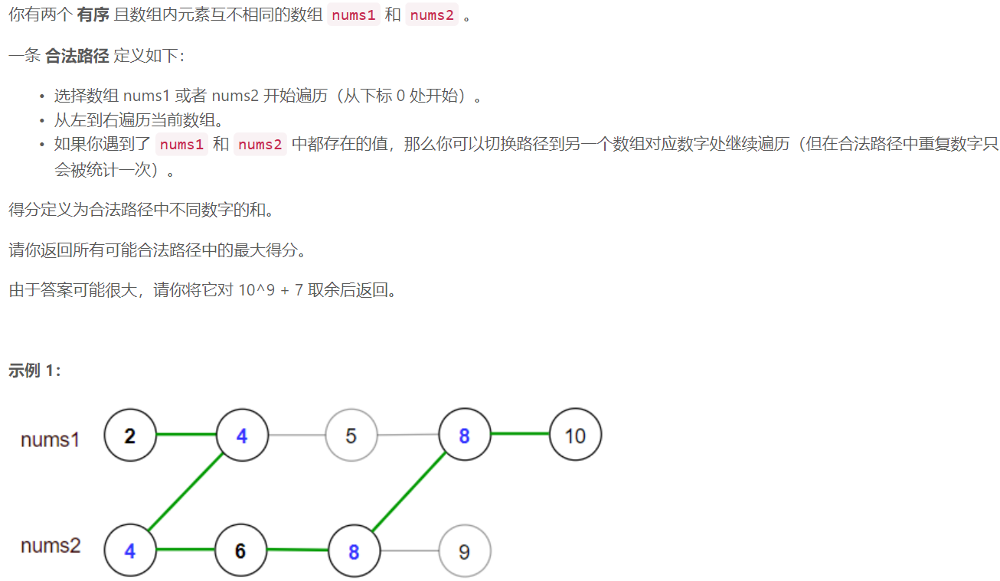

### 5478. 最大得分


    


## C++ solution
```c++
class Solution {
    typedef long long ll;
    const int P=1000000007;
public:
    int maxSum(vector<int>& nums1, vector<int>& nums2) {
        int n=nums1.size(),m=nums2.size(),i,j;
        long long s1=0,s2=0;
        for(i=n-1,j=m-1;~i&&~j;)if(nums1[i]>nums2[j])
        {
            s1+=nums1[i];
            i--;
        }
        else if(nums1[i]<nums2[j])
        {
            s2+=nums2[j];
            j--;
        }
        else
        {
            s1=s2=max(s1,s2)+nums1[i];
            i--;
            j--;
        }
        for(;~i;i--)s1+=nums1[i];
        for(;~j;j--)s2+=nums2[j];
        return max(s1,s2)%P;
    }
};
```

## Java solution 

```java
class Solution {
    //注意这里是 将结果对 10^9 + 7 取余后返回 而不是取余数的最大值
    int mod=(int)1e9+7;
    long[] dp=new long[(int)1e7+5];//dp[i] 表示从某个合理路径经过i时的最大路径和
    public int maxSum(int[] nums1, int[] nums2) {
        
        long res=0;
        int n1=nums1.length,n2=nums2.length;
        int i=n1-1,j=n2-1;
        for(int k=0;k<=Math.max(nums1[i],nums2[j]);k++)dp[k]=0;
        while(i>=0 || j>=0)//路径是从后往前的 先遍历nums1和nums2中更大的那个值
        {
            if(i<0 || (i>=0 && j>=0 && nums1[i]<nums2[j]))
            {
                long plus=j==n2-1?0:dp[nums2[j+1]];
                dp[nums2[j]]=Math.max(dp[nums2[j]],nums2[j]+plus);
                res=Math.max(res,dp[nums2[j]]);
                --j;
            }
            else if(j<0 || (i>=0 && j>=0 && nums1[i]>nums2[j]))
            {
                long plus=i==n1-1?0:dp[nums1[i+1]];
                dp[nums1[i]]=Math.max(dp[nums1[i]],nums1[i]+plus);
                res=Math.max(res,dp[nums1[i]]);
                --i;
            }
            else
            {
                long plus1=i==n1-1?0:dp[nums1[i+1]];
                long plus2=j==n2-1?0:dp[nums2[j+1]];
                long plus=Math.max(plus1,plus2);
                dp[nums1[i]]=Math.max(dp[nums1[i]],nums1[i]+plus);
                res=Math.max(res,dp[nums1[i]]);
                --i;
                --j;
            }
        }
        return (int)(res%mod);
    }
}
```

