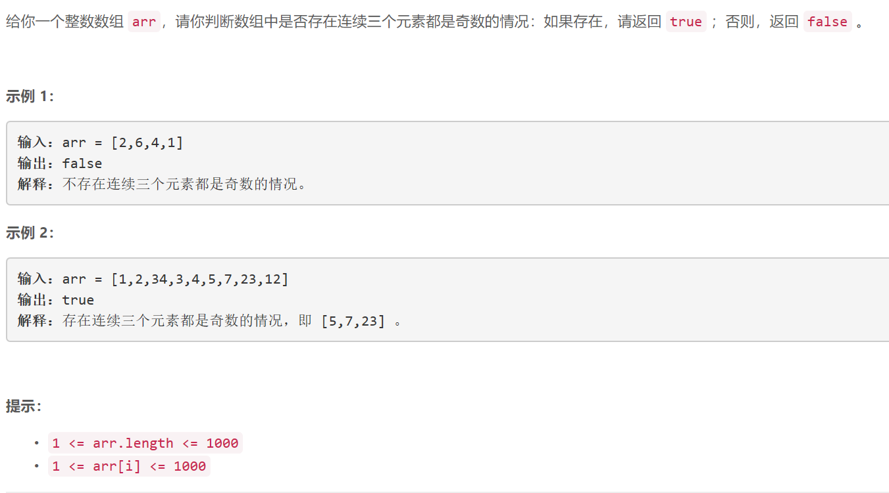

### 5185. 存在连续三个奇数的数组

###       

## Java solution

```java
class Solution {
    public boolean threeConsecutiveOdds(int[] arr) {
         int cnt=0;
         for(Integer a:arr)
         {
             if(a%2==1)cnt++;
             else cnt=0;
             if(cnt==3)return true;
         }
         return false;
    }
}

```