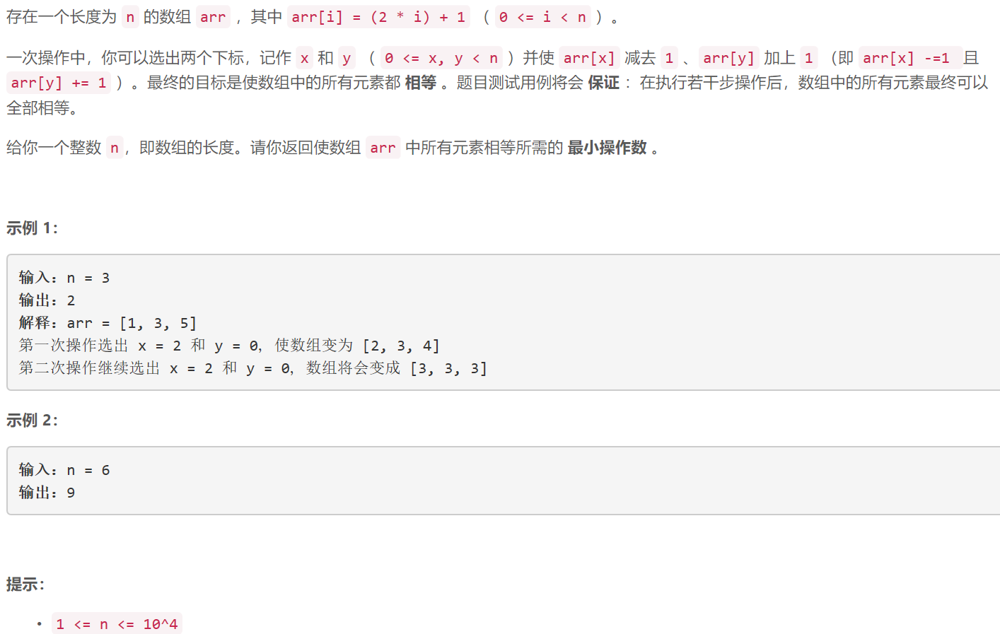

### 5488. 使数组中所有元素相等的最小操作数

  


## Java solution
```java
class Solution {
    public int minOperations(int n) {
      int res=0;  
      int plus=n%2==1?2:1;
      for(int i=0;i<(n/2);i++)
      {
          res+=plus;
          plus+=2;
      }
      return res;
    }
}
```