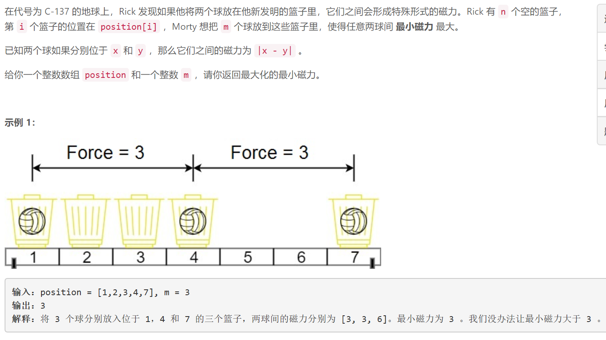
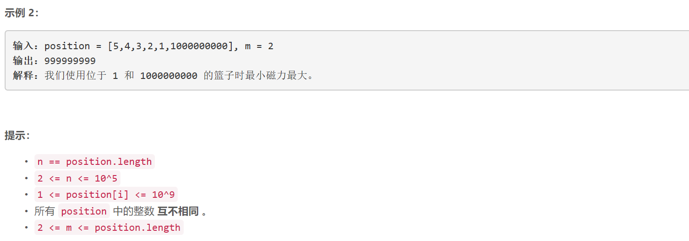

### 5489. 两球之间的磁力

###      



## Java solution

```java
class Solution {
    public int maxDistance(int[] position, int m) {
          int l=0,r=(int)1e9,mid;
          Arrays.sort(position);
          while(l<r)
          {
              //当l=r-1 时 mid=r 如果cnt>=m l=r 反之r=r-1=l 那么无论如何l=r跳出循环
              mid=(l+r+1)>>1;//当前最小间距为mid
              int last=0;//上一个满足最小间隔的位置+最小间隔
              int cnt=0;//当前间距mid情况下 满足间距大于最小间距的数目
              for(int p:position)
              {
                  if(p>=last)
                  {
                      ++cnt;
                      last=p+mid;
                  }
              }
              //System.out.print(l+" "+r+" "+mid+" "+cnt+"\n");
              if(cnt>=m) l=mid;//满足最小间距为mid 的间隔数有m以上个 说明间隔大小还可以变大
              else r=mid-1;//满足最小间距为mid 的间隔数少于m个 说明间隔只能变小
          }
          return l;

    }
}
```


