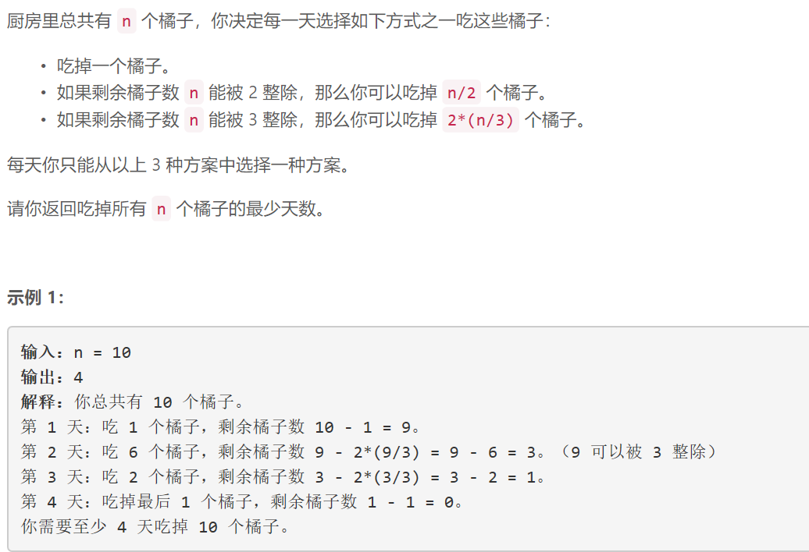
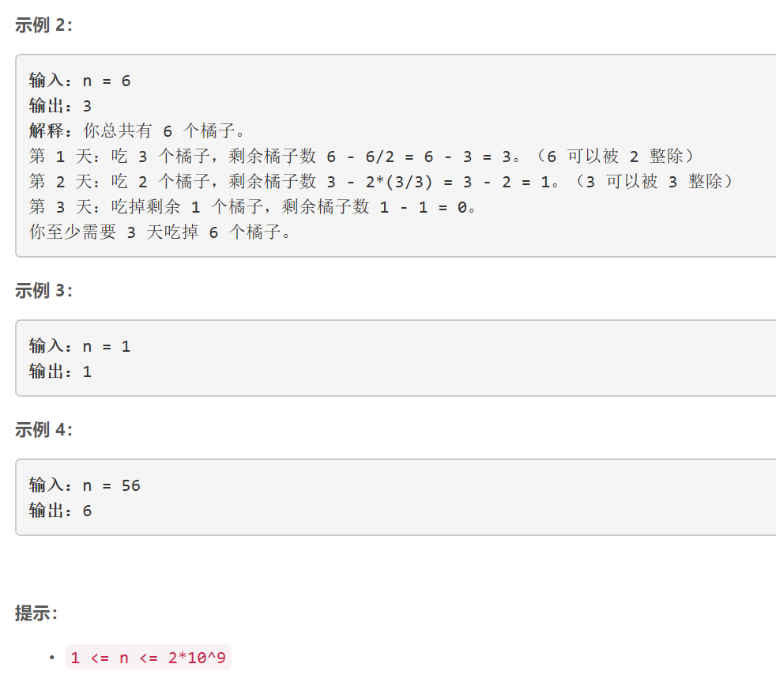

### 5490. 吃掉 N 个橘子的最少天数


    



## Java solution 

```java
class Solution {
    HashMap<Integer,Integer> map=new HashMap<>();
    public int minDays(int n) {
        if(n==0 || n==1) return n;
        if(map.containsKey(n))return map.get(n);
        int res=Math.min(minDays(n/2)+n%2+1,minDays(n/3)+n%3+1);
        // 先花n%3天，每天吃1个橘子 接下来前吃掉2*n/3个橘子 剩下的递归计算
        map.put(n,res);
        return res;
     /*   
     针对以下情况 minDays(3)出现了了两次 那么只需要计算第一次的值即可
        minDays(20)
        minDays(6) minDays(10)
       minDays(2) minDays(3) minDays(5) minDays(3) 
    */
    }
}
```

