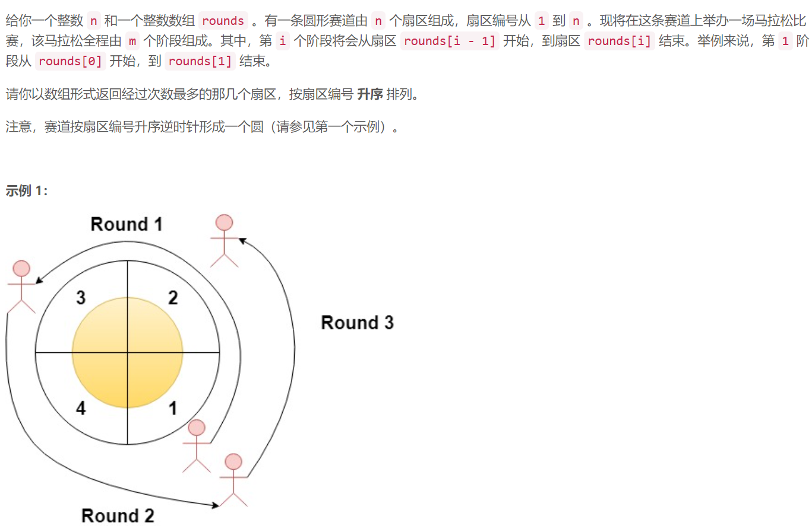
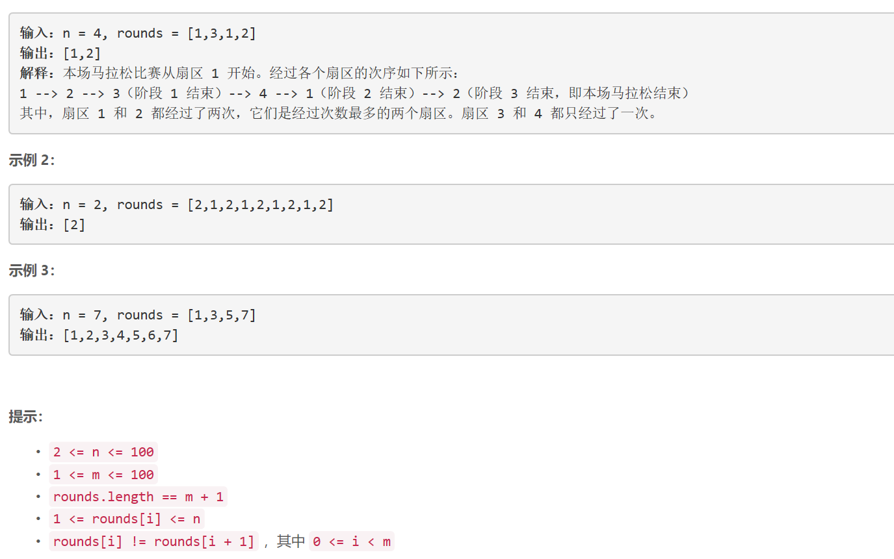

### 1560. 圆形赛道上经过次数最多的扇区

### 

###       

## Java solution

```java
class Solution {
    public List<Integer> mostVisited(int n, int[] rounds) {
        List<Integer> res=new ArrayList<>();
        int m=rounds.length-1;
        int start=rounds[0],end=rounds[m];
        if(start<end)for(int i=start;i<=end;i++)res.add(i);
        else  if(start>end)
        {
            for(int i=start;i<=(n+end);i++)
            {
               int add=i<=n?i:i%n; 
               res.add(add);
            }
        }
        else res.add(start);
        Collections.sort(res);
        return res;
    }
}

```