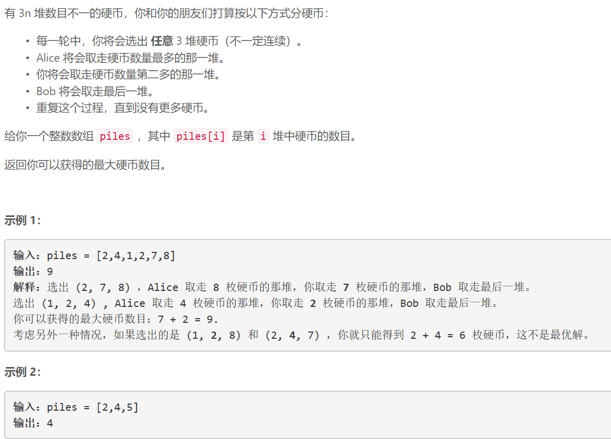
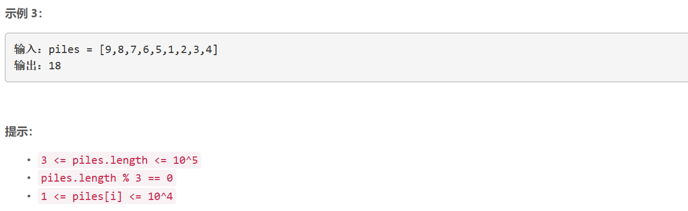

### 1561. 你可以获得的最大硬币数目

  



## Java solution

```java
class Solution {
    public int maxCoins(int[] piles) {
        Arrays.sort(piles);
        int n=piles.length;
        int cnt=n/3;    
        int res=0;
        for(int i=n-2;cnt>0;i-=2,cnt--)res+=piles[i];
        return res;
    }
}
```