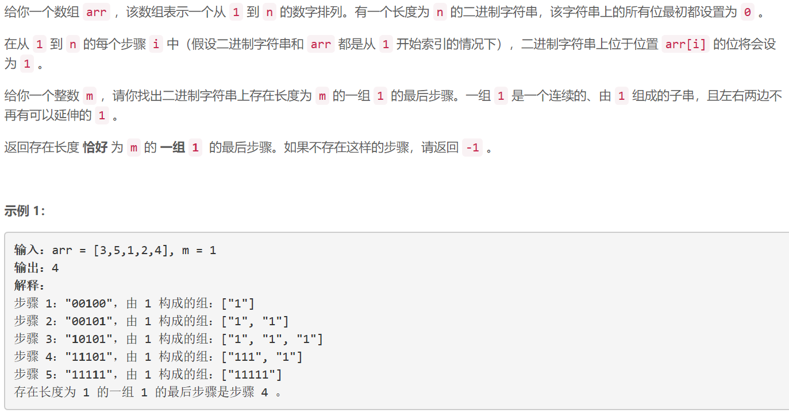
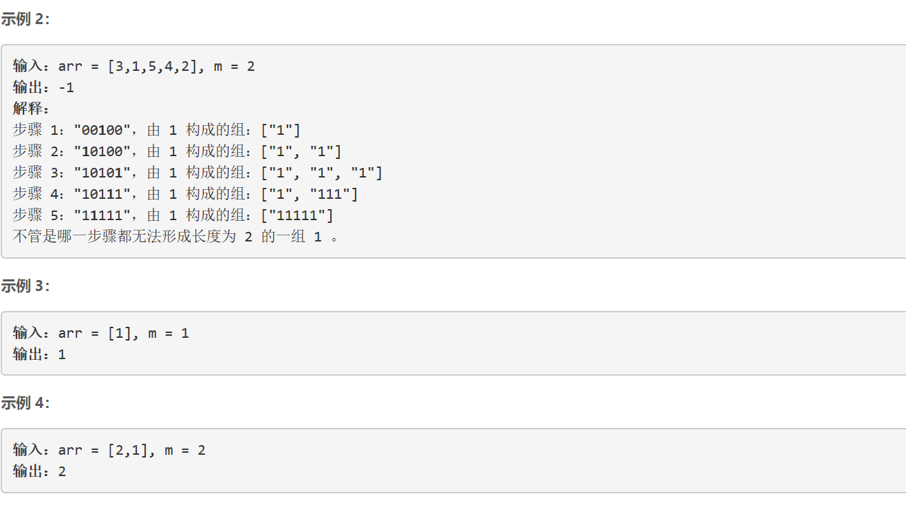
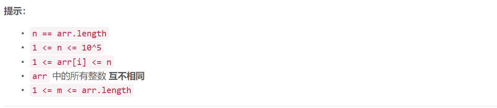

### 1562. 查找大小为 M 的最新分组

###      





## Java solution

```java
class Solution {
    public int findLatestStep(int[] arr, int m) {
        int n=arr.length;
        TreeMap<Integer,Integer> map=new TreeMap<>();//按照键值大小懂小到大排序 也可以自定义排序方法
        //到第n天的时候 有n个连续的'1'
        if(m==n) return n;
        map.put(1,n);//一个全为'1'字符串起始位置是1 结束为止是n map(start,end) 
        //从步骤n开始向之前步骤遍历 
        for(int i=n-1;i>=0;i--)
        {
            int idx=arr[i];
            int start=map.floorKey(idx); //返回小于等于键值idx的最大键值
            int end=map.get(start);
            //步骤i+1到步骤i 将字符串位置arr[i]的'1'修改为'0' 
            //包含原位置arr[i]的全'1'字符串 步骤i+1到步骤i 从i位置截断 分割成两个全1 字符串
            //    111111111111111111111111
            //    start      arr[i]      end  原来
            //之后1111111111     0         1111111111111
            //   start     end   arr[i]   start      end
            if(idx>start)
            {
                if(idx-start==m) return i;//新分割的字符串长度为m 由于是从最后一个步骤向之前步骤遍历 因此步骤i-1就是长度恰好为m的一组1的最后步骤  由于步骤是从0开始而不是从1开始 所以返回i-1+1=i
                map.put(start,idx-1);
            }
            if(idx<end)
            {
                if(end-idx==m) return i;
                map.put(idx+1,end);
            }
        }
        return -1;
    }
    
}
```


