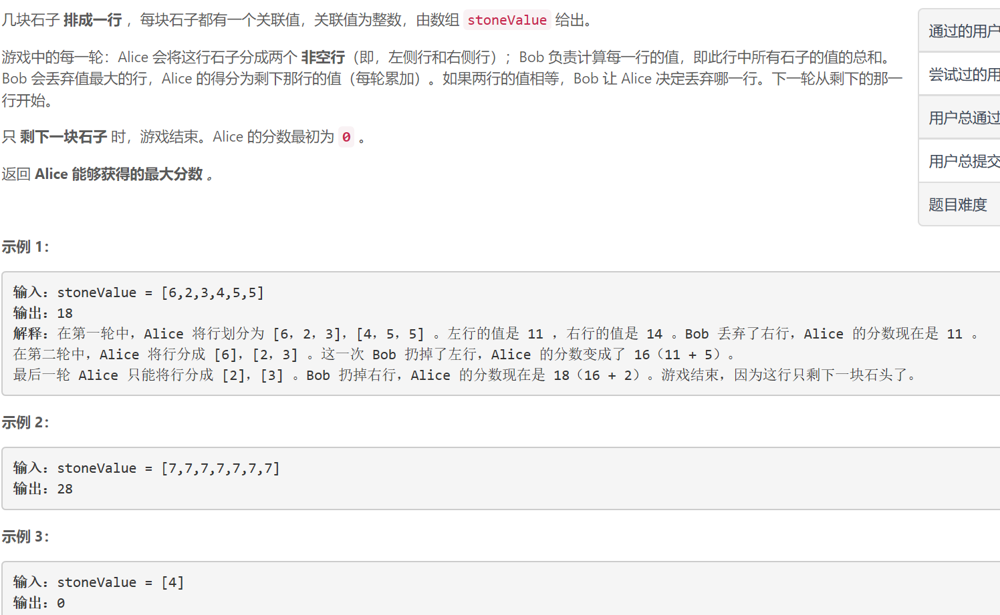
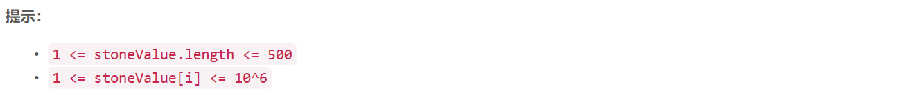

### 5498. 石子游戏 V


    



## Java solution 

```java
class Solution {
    int[][] sum=new int[505][505];//sum[start][end] 表示区间[start,end) 的分数之和
    int[][] dp=new int[505][505];
    //dfs+记忆化搜索 dp[start][end] 表示区间[start,end) 的最大得分
    public int stoneGameV(int[] stoneValue) {
         int n=stoneValue.length;
         for(int[] i:dp)Arrays.fill(i,-1);
         for(int i=0;i<n;i++)
         {
             for(int j=i+1;j<=n;j++)
             {
                 sum[i][j]=sum[i][j-1]+stoneValue[j-1];
             }
         }
         return dfs(stoneValue,0,n);
    }
    private int dfs(int[] v,int start,int end)
    {
        if(dp[start][end]!=-1) return dp[start][end];
        if(start==end-1) return 0;
        int res=0;
        for(int i=start+1;i<end;i++)
        {
            if(sum[start][i]>sum[i][end]) res=Math.max(dfs(v,i,end)+sum[i][end],res);
            else if(sum[start][i]<sum[i][end]) res=Math.max(dfs(v,start,i)+sum[start][i],res);
            else 
            {
                int tmp=Math.max(dfs(v,i,end),dfs(v,start,i));
                res=Math.max(tmp+sum[start][i],res);
            }
        }
        return dp[start][end]=res;
    }
}
```

