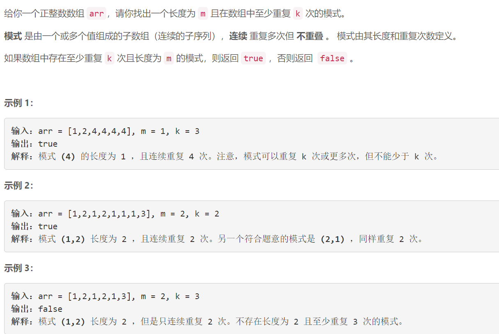
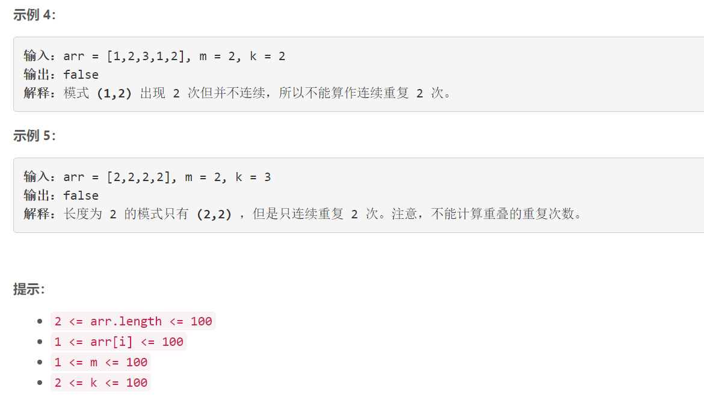

### 5499. 重复至少 K 次且长度为 M 的模式

### 

###       

## Java solution

```java
class Solution {
    public boolean containsPattern(int[] arr, int m, int k) {
       int n=arr.length; 
       for(int i=0;i<n-m+1;i++)
       {
           if(dfs(arr,1,k,m,i+m,i,i+m-1)) return true;
       }
       return false; 
    }
    private boolean dfs(int[] arr,int cnt,int k,int m,int cur,int start,int end)
    {
        int n=arr.length;
        if(cnt==k) return true;
        if(cur+m>n) return false;
        
        if(check(arr,start,end,cur) && dfs(arr,cnt+1,k,m,cur+m,start,end) ) return true;
        return false;
        
    }
    private boolean check(int[] arr,int a,int b,int c)
    {
        int j=c;
        for(int i=a;i<=b;i++)
        {
            if(arr[i]!=arr[j++]) return false;
        }
        return true;
    }
}

```