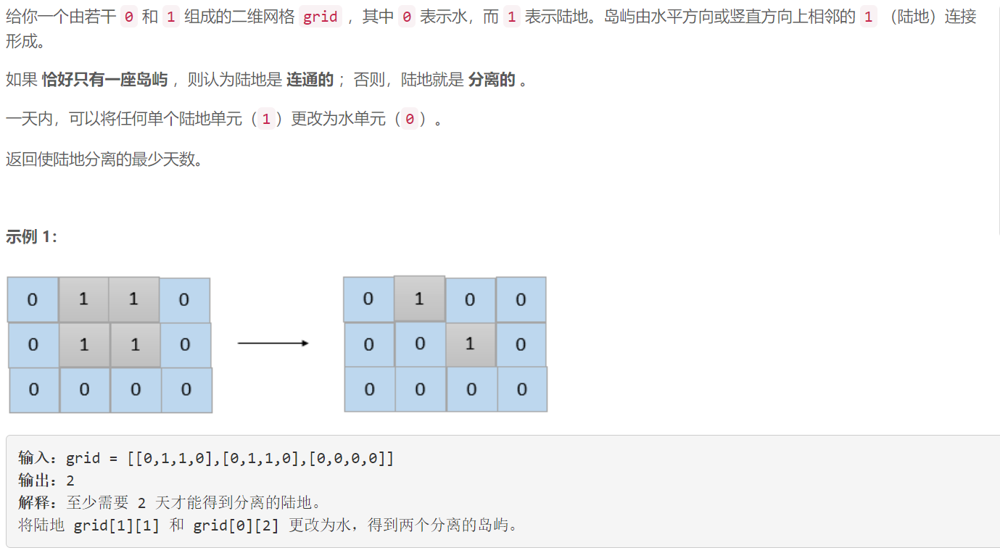
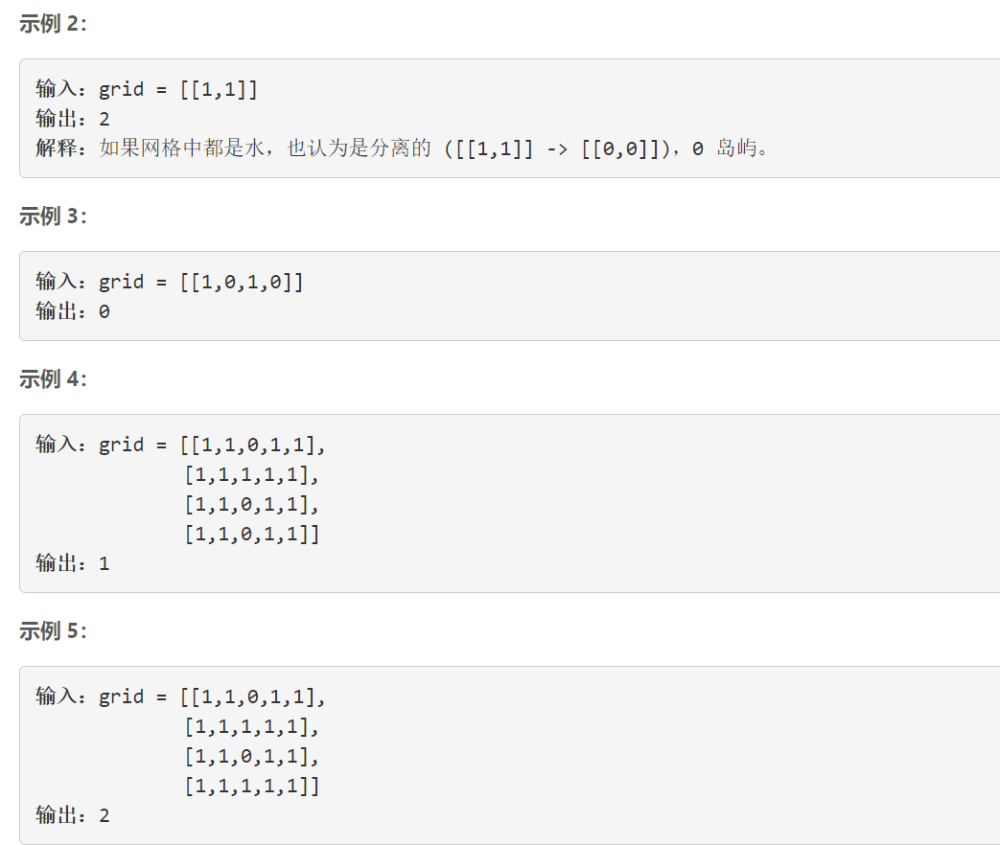

### 5500. 乘积为正数的最长子数组长度


    



## Java solution 

```java
class Solution {
    public int getMaxLen(int[] nums) {
        int res=0;
        int n=0,p=0;//n是包含当前元素乘积为正的最大长度 p是包含当前元素乘积为负的最大长度
        for(int i=0;i<nums.length;i++)
        {
            if(nums[i]==0)
            {
                n=0;
                p=0;
            }
            else if(nums[i]>0)
            {
                n=n==0?0:n+1;
                p=p+1;
            }
            else 
            {
                int temp=p;
                p=n==0?0:n+1;
                n=temp+1;                        
            }
            res=Math.max(res,p);
        }
        return res;
    }

}
```

