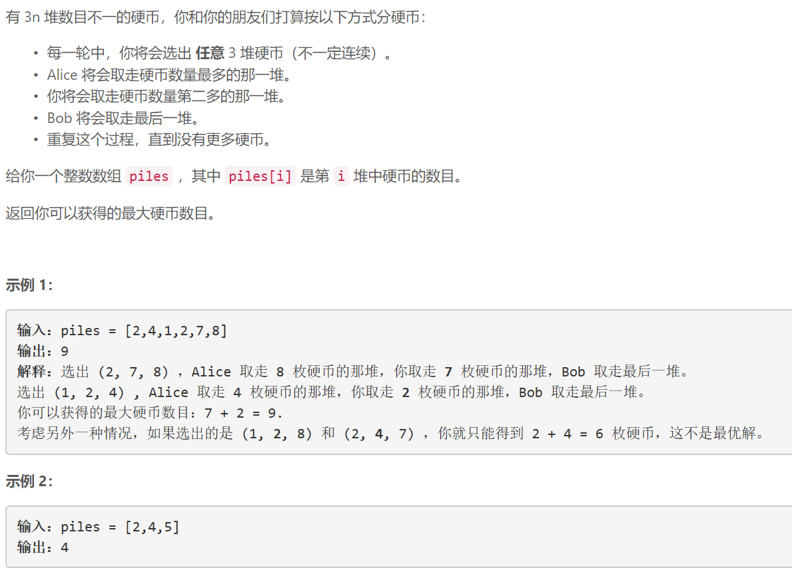
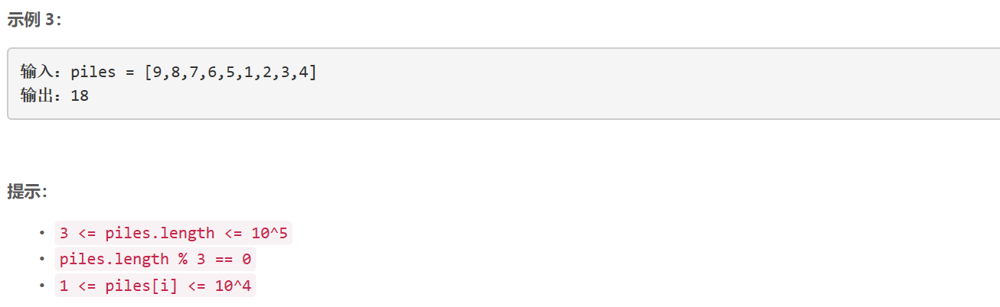

### 5501. 使陆地分离的最少天数

  



## Java solution

```java
class Solution {
    int[] d={-1,0,1,0,-1};
    int res=35;
    public int minDays(int[][] grid) {
        int m=grid.length,n=grid[0].length;
        if(cnt(grid)!=1) return 0; //无需改变陆地就是分离的 
        for(int i=0;i<m;i++) for(int j=0;j<n;j++) if(grid[i][j]==1)
        {
            grid[i][j]=0;
            if(cnt(grid)!=1) return 1;//改变一个单元之后陆地是分离的 
            grid[i][j]=1;
        }
        //最多只需改变2个单元  一定能分离出一个单独的岛屿
        // 10  需要1天    11  需要2天  11 需要2天  10  需要0天
        // 11            11           00          01
        return 2;
    }
    private int cnt(int[][] grid) //计算当前的岛屿个数
    {
        int m=grid.length,n=grid[0].length;
        boolean[][] visited=new boolean[m][n];
        int cnt=0;
        for(int i=0;i<m;i++) for(int j=0;j<n;j++) if(!visited[i][j] && grid[i][j]==1)
        {
            dfs(grid,i,j,visited);
            cnt++;
        }
        return cnt;
    }
    private void dfs(int[][] grid,int x,int y,boolean[][] visited)
    {
        if(x>=grid.length || x<0 || y>=grid[0].length || y<0) return ;
        if( grid[x][y]==0 ||  visited[x][y]) return ;
        visited[x][y]=true;
        for(int i=0;i<4;i++) dfs(grid,x+d[i],y+d[i+1],visited);
    }
}
```