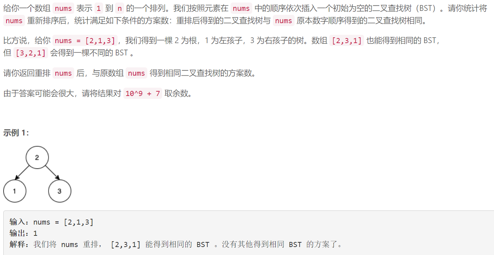
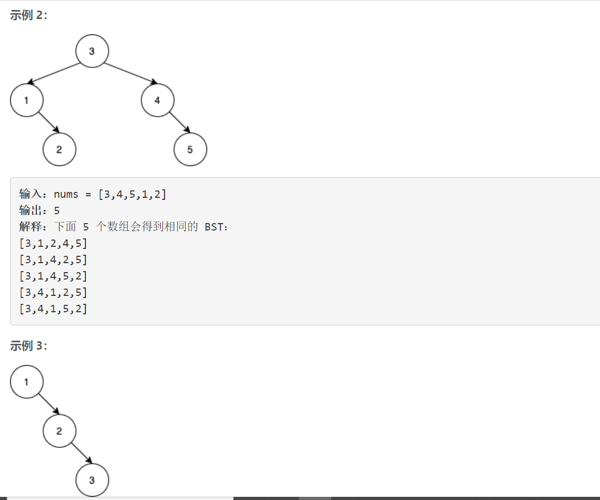
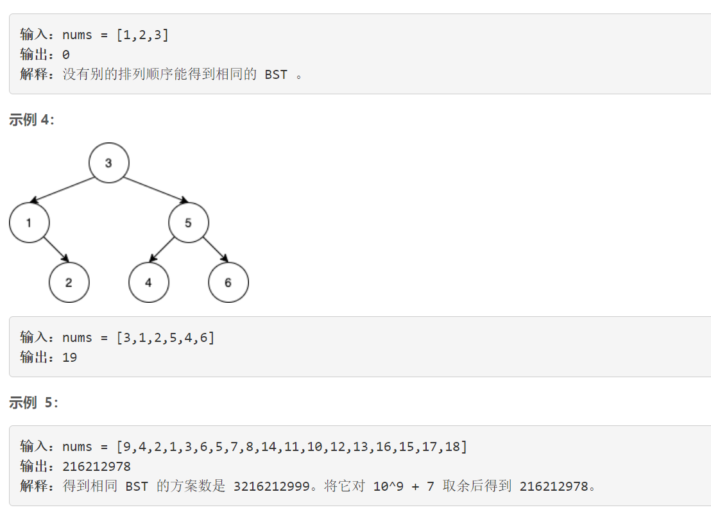
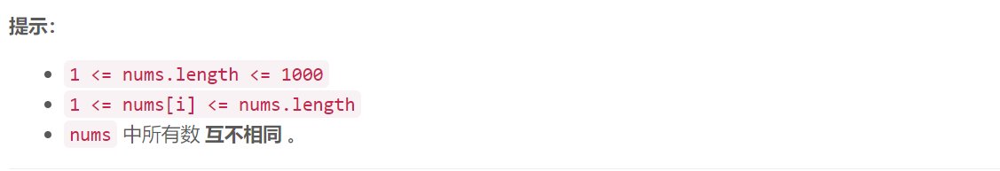

### 5502. 将子数组重新排序得到同一个二叉查找树的方案数

###      







## Java solution

```java
/*
二叉査找树，又称二叉排序树，二叉搜索树。其特点是，右子树中的元素都小于根节点，左子树的元素都大于根节点，且左右子树也都是二叉搜索树。当构造一棵二叉搜索树时，第一个插入的元素必然是根节点，其后插入的元素根据与根节点的大小关系被插入到左子树或右子树。
由此可知，如果两种排列对应的二叉搜索树相同，那么必然第一个元素是相同的
设，小于第一个的元素构成的序列为less，大于第一个的元素构成的序列为 greater。在不修改1ess, greater
内部顺序的前提下，调整ess+ greater这个大序列的顺序，就能得到一个可以构造相同二叉树的新序列
换个说法，less的顺序确定了元素插入左子树的顺序，同样的， greater确定了元素插入右子树的顺序。至于，
是先构造左子树还是构造右子树，并不重要。所以Iess+ greater I的顺序可以调整。
那为何less和 greater的内部顺序不能调整呢？其实不是不能调整，而是要放到构造左右子树的时候再去调
那么，还剩最后一个问题，Iess+ greater，一共有多少符合要求排列方式呢？答案为
less size）+greater size)
也就是说，一共有x个坑，先选出一部分放1ess，剩下的放 greater.
最后将每个子树的组合数累乘即可
*/
class Solution {
    long[] fact=new long[1005];
    long[][] c=new long[1005][1005];
    long mod=(long)1e9+7;
    long res=1;
    public int numOfWays(int[] nums) {
       int n=nums.length; 
       //combine(m,n)=combine(m-1,n-1)+combine(m-1,n)
       for(int i=0;i<n;i++)c[i][0]=1;
       for(int i=1;i<n;i++)
       {
           for(int j=1;j<=i;j++)
           {
              c[i][j]=(c[i-1][j]+c[i-1][j-1])%mod;
           } 
       }
       List<Integer> l=new ArrayList<>();
       for(int i=0;i<nums.length;i++)l.add(nums[i]);
       dfs(l);
       return (int)(res-1);
    }
    private void dfs(List<Integer> list)
    {
        if(list.size()<=2) return ;
        List<Integer> less=new ArrayList<>();
        List<Integer> great=new ArrayList<>();
        int root=list.get(0);
        for(int i=1;i<list.size();i++)
        {
           int cur=list.get(i); 
           if(cur<root)less.add(cur);
           else great.add(cur);
        }
        dfs(less);
        dfs(great);
        int m=less.size(),n=great.size();
        res=res*c[m+n][n]%mod;
    } 
}
```


