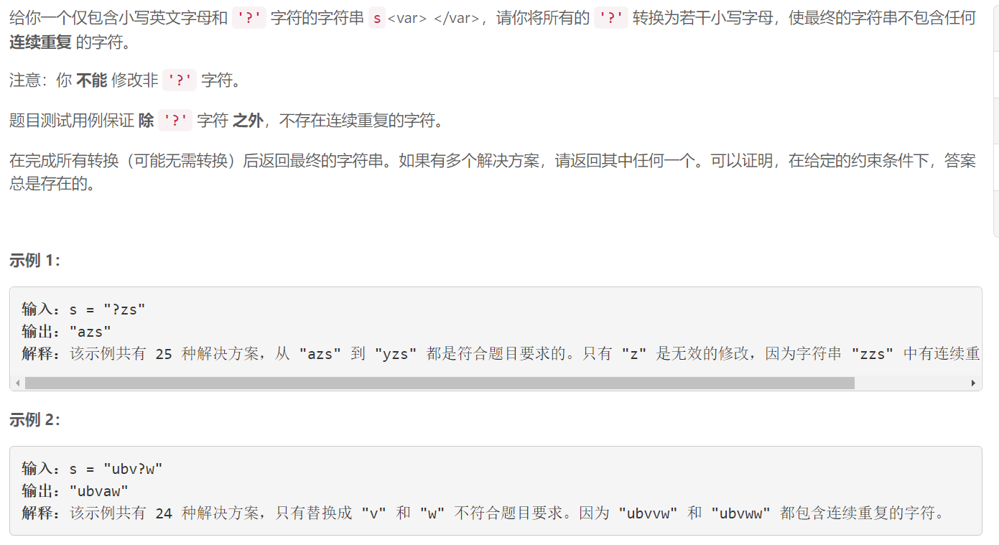
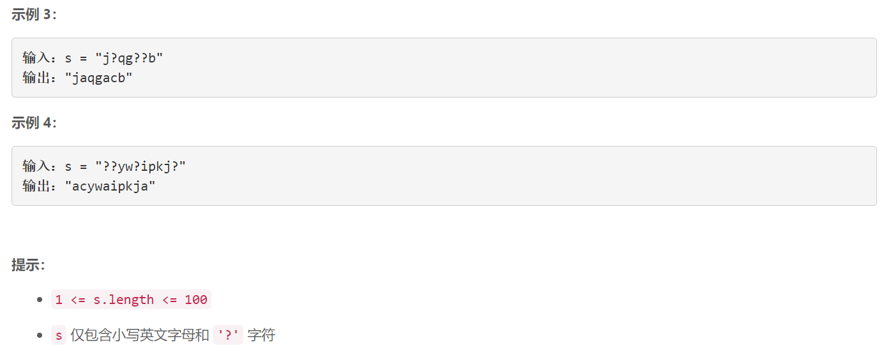

### 1576. 替换所有的问号

### 

###       

## Java solution

```java
class Solution {
    public String modifyString(String s) {
        int n=s.length();
        char[] str=s.toCharArray();
        char prev='1';
        //for(char c:str)System.out.print(c+"\n");
        for(int i=0;i<n-1;i++)
        {
            
            if(str[i]=='?')
            {
                for(char j='a';j<='z';j++)
                {
                    if(j!=prev && j!=str[i+1])
                    {
                        str[i]=j;
                        prev=j;
                        break;
                    }
                }
            }
            else prev=str[i];
        }
        if(str[n-1]=='?')for(char j='a';j<='z';j++)
        {
                    if(j!=prev )
                    {
                        str[n-1]=j;                        
                        break;
                    }
        }
        StringBuilder res=new StringBuilder();
        for(char c:str)
        {
            res.append(c);
            //System.out.print(c+"\n");
        }
        return res.toString();
    }
}

```