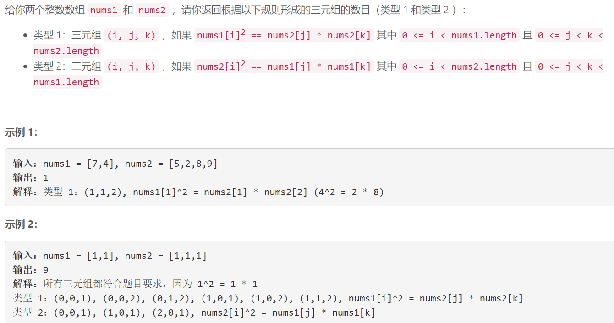
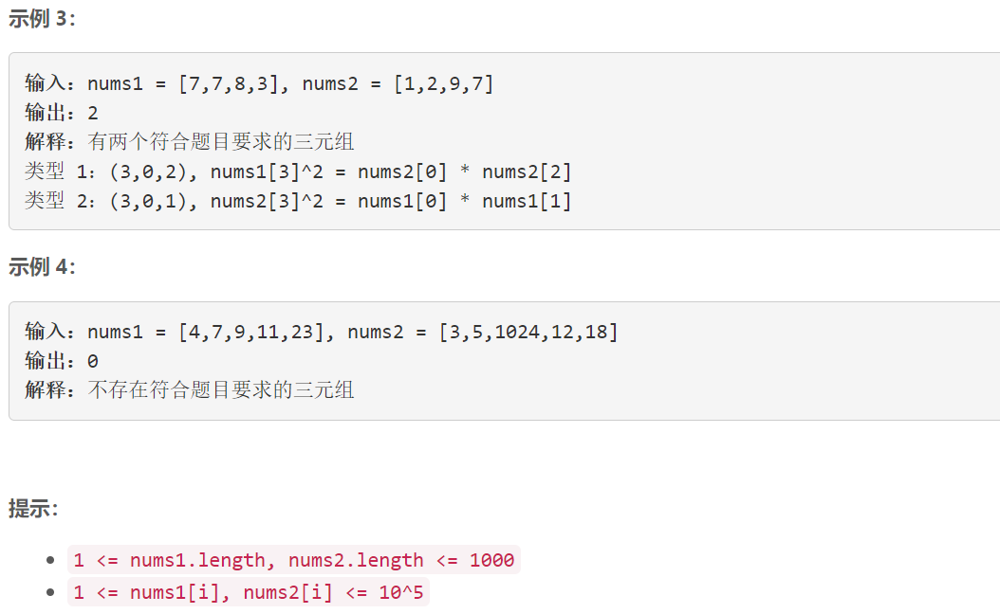

### 5508. 数的平方等于两数乘积的方法数


    



## Java solution 

```java
class Solution {
    public int numTriplets(int[] nums1, int[] nums2) {
        return helper(nums1,nums2)+helper(nums2,nums1);
    }
    private int helper(int[] nums1,int[] nums2)
    {
        int cnt=0;
        int len2=nums2.length;
        Map<Long,Integer> map1=new HashMap<>();
        Map<Long,Integer> map2=new HashMap<>();
        for(int n1:nums1)
        {
            long p=(long)n1*(long)n1;
            map1.put(p,map1.getOrDefault(p,0)+1);
        }
        for(int i=0;i<len2;i++)
        {
            for(int j=i+1;j<len2;j++)
            {
                long p=(long)nums2[i]*(long)nums2[j];
                map2.put(p,map2.getOrDefault(p,0)+1);
            }
        }
        for(Long val:map1.keySet())
        {
            cnt+=map1.get(val)*map2.getOrDefault(val,0);
        }
        return cnt;
    }
}
```

