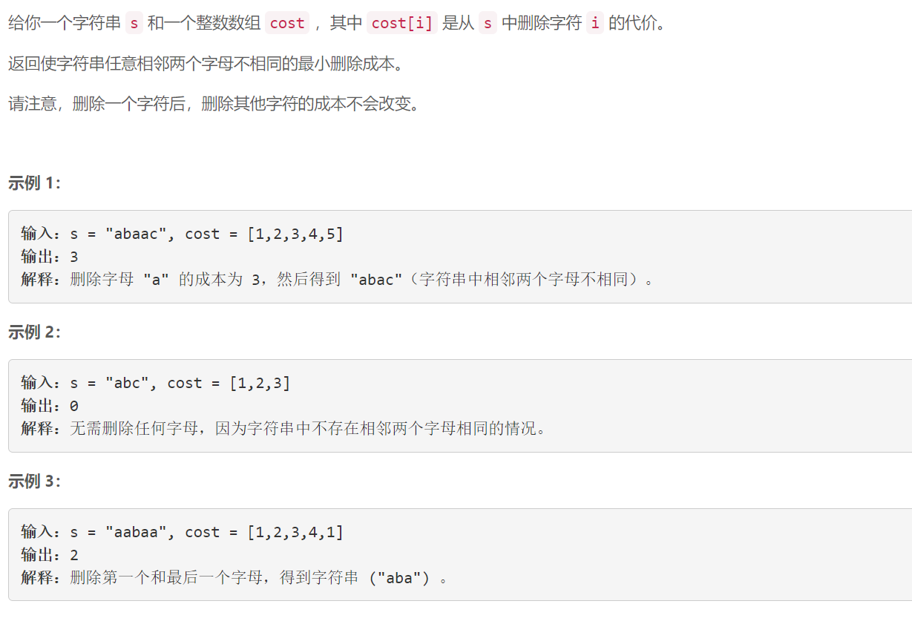
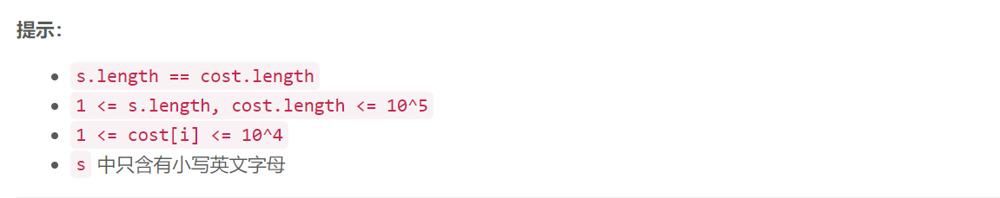

### 5509. 避免重复字母的最小删除成本

  



## Java solution

```java
class Solution {
    public int minCost(String s, int[] cost) {
      char[] str=s.toCharArray();
      int i=0,n=s.length();  
      int res=0;  
      while(i<n)
      {
          int sum=cost[i];
          int max=cost[i];
          ++i;
          for(;i<n&&str[i]==str[i-1];++i)
          {
              sum+=cost[i];
              max=Math.max(cost[i],max);
          }
          res+=sum-max;    
      }
      return res;
    }
}
```