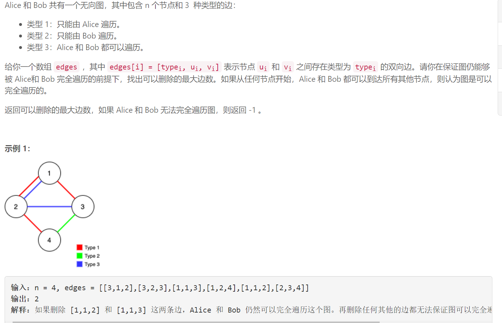
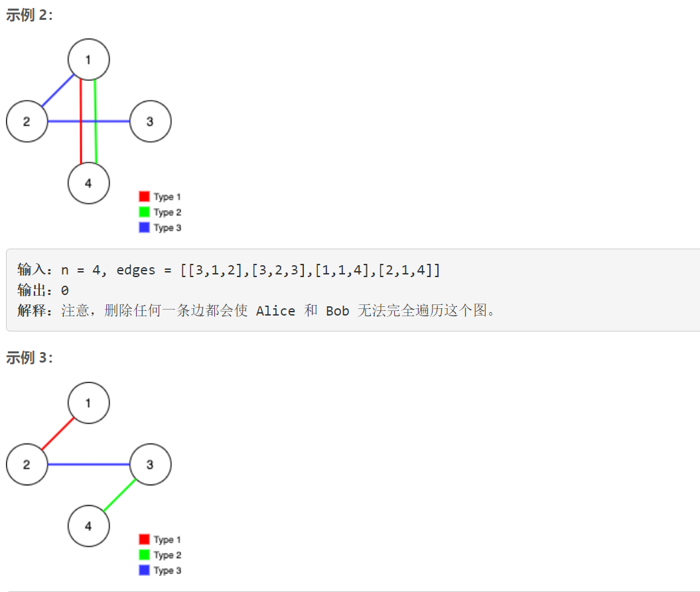
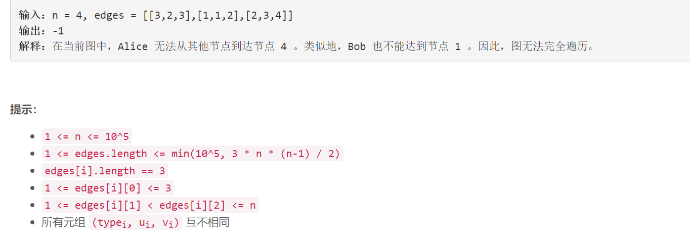

### 5510. 保证图可完全遍历

###      





## Java solution

```java
class Solution {
    public int maxNumEdgesToRemove(int n, int[][] edges) {
        Arrays.sort(edges,(a,b)->Integer.compare(b[0],a[0]));//按照边类型降序排列这样优先访问类型3的边
        boolean[] used=new boolean[edges.length];
        if(unionFind(n,edges,used,1)!=1)return -1;
        if(unionFind(n,edges,used,2)!=1)return -1;
        int res=0;//如果一条边没有被使用 那么这一条边可以被删除
        for(int i=0;i<edges.length;i++)if(!used[i])res++;
        return res;
    }
    //并查集    
    private int unionFind(int n,int[][] edges,boolean[] used,int excludedType)
    {
        int[] union=new int[n+1];
        for(int i=1;i<=n;i++) union[i]=i;
        for(int i=0;i<edges.length;i++)
        {
            int[] e=edges[i];
            if(e[0]==excludedType)continue;///当前边是被排除在外的类型
            int rootA=findRoot(union,e[1]);
            int rootB=findRoot(union,e[2]);
            if(rootA!=rootB) //将两节点相连
            {
                union[rootA]=rootB;
                used[i]=true;
            }
        }
        int unionNum=0;
        //并查集结束后 如果所有节点是联通的 那么所有节点应该指向唯一root 所以返回是1 否则返回值大于1那么不是完全联通的
        for(int i=1;i<=n;i++)if(union[i]==i)unionNum++;
        return unionNum;
    }
    private int findRoot(int[] union,int idx)
    {
        if(union[idx]!=idx)//返回idx所属集合的根结点
        {
           int root=findRoot(union,union[idx]);
           union[idx]=root;//路径压缩 直接将当前节点指向根结点 以缩短查询时间
           return root; 
        }    
        return idx;
    }
        
}
```


