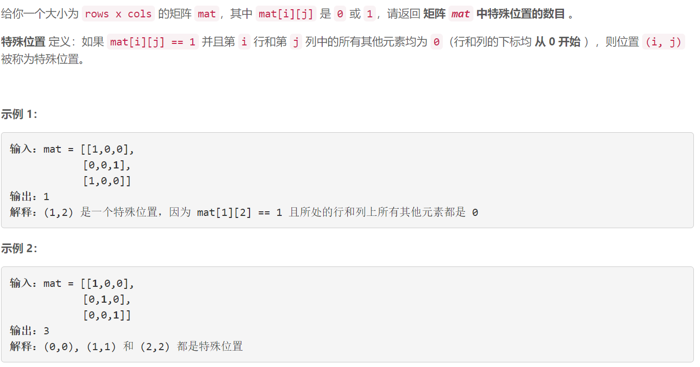

### 5511. 二进制矩阵中的特殊位置

### 

###       

## Java solution

```java
class Solution {
    public int numSpecial(int[][] mat) {
        int m=mat.length,n=mat[0].length;
        boolean[] dp1=new boolean[m];
        boolean[] dp2=new boolean[n];
        for(int i=0;i<m;i++)
        {
            int cnt=0;
            for(int j=0;j<n;j++)if(mat[i][j]==1)cnt++;
            if(cnt==1) dp1[i]=true;
        }
        for(int j=0;j<n;j++)
        {
            int cnt=0;
            for(int i=0;i<m;i++)if(mat[i][j]==1)cnt++;
            if(cnt==1) dp2[j]=true;
        }
        int res=0;
        for(int i=0;i<m;i++)for(int j=0;j<n;j++)
        {
            if(mat[i][j]==1 && dp1[i] && dp2[j])res++;
        }
        return res;
    }
}

```