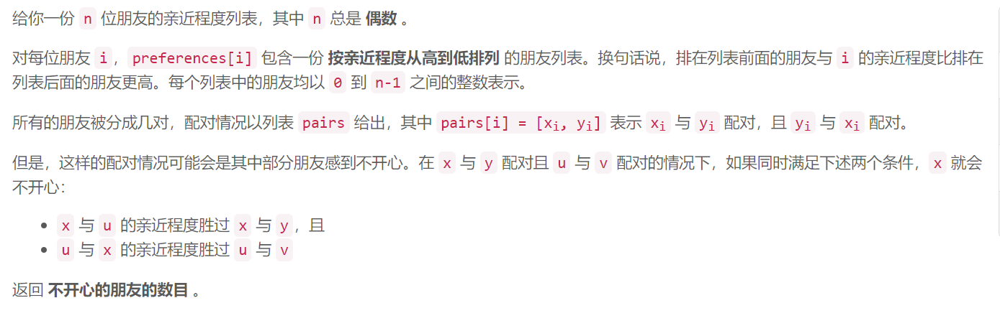
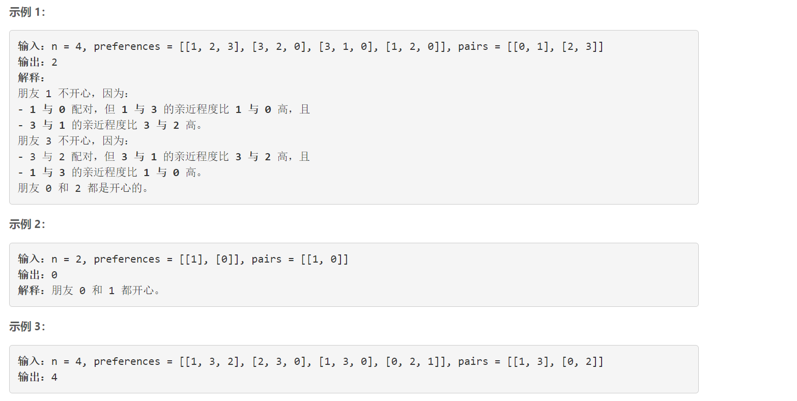
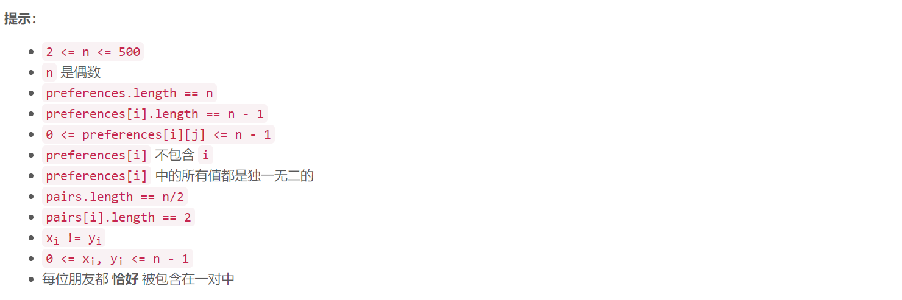

## 5512 统计不开心的朋友


    





## Java solution 

```java
class Solution {
    public int unhappyFriends(int n, int[][] preferences, int[][] pairs) {
        HashMap<Integer,Integer> map=new HashMap<>();
        for(int[] p:pairs)
        {
            map.put(p[0],p[1]);
            map.put(p[1],p[0]);
        }
        int res=0;
        for(int x=0;x<n;x++)
        {
            int y=map.get(x);
            boolean flag=false;
            for(int i=0;i<n-1 && preferences[x][i]!=y && (!flag);i++)
            {
                int u=preferences[x][i];
                int v=map.get(u);
                for(int j=0;j<n-1 && preferences[u][j]!=v;j++)if(preferences[u][j]==x)
                {
                   flag=true;
                    res++;
                   break; 
                }
            }
        }
        return res;
    }
  
}
```

