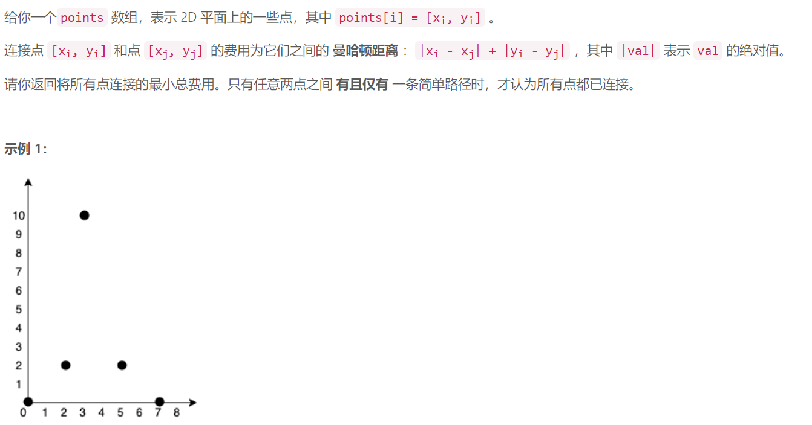
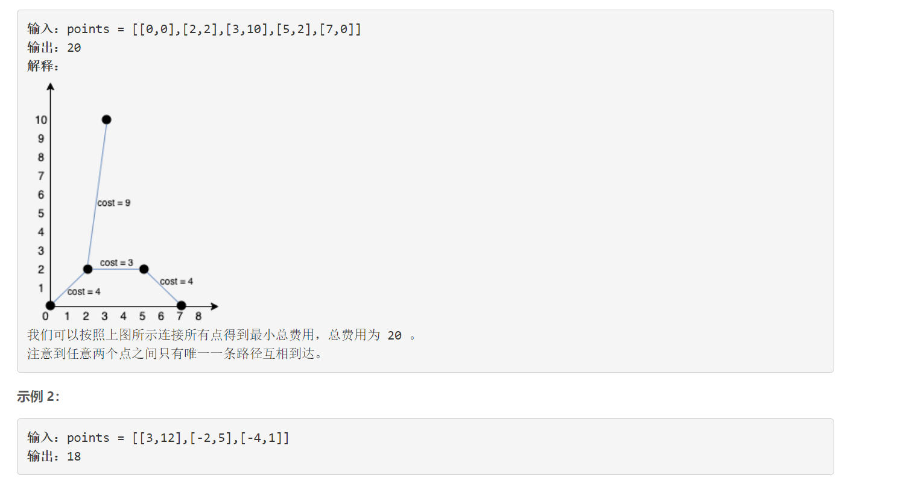
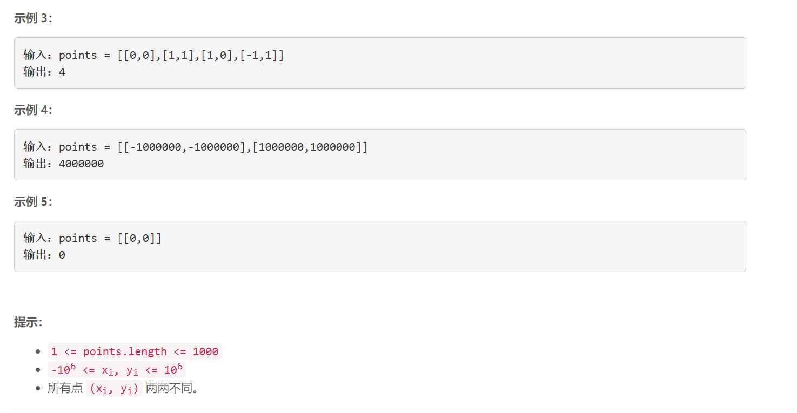

### 5513. 连接所有点的最小费用

  





## Java solution

```java
class Solution {
    public int minCostConnectPoints(int[][] points) {
         int N=points.length;
         int res=0;
        List<Edge> list = new ArrayList<>();
         for (int i = 0; i < N; i++) {
            for (int j = i + 1; j < N; j++) {
                int x1=points[i][0],y1=points[i][1];
                int x2=points[j][0],y2=points[j][1];
                list.add(new Edge(i, j, D(points,x1,y1,x2,y2)));
            }
        }
        Collections.sort(list);
        int[] parent = new int[N];
        for (int i = 1; i < N; i++) {
            parent[i] = i;
        }
        int cnt=0;
        for (Edge edge : list) {
            //寻找这两个点有没有相同的父节点
            int rootA = find(parent, edge.begin);
            int rootB= find(parent, edge.end);
            // edge.begin < edge.end 
            if(rootA!=rootB)
            {
                parent[rootB] = rootA;//将两个节点的根节点向量
                res+=edge.weight;
                cnt++;
            }
            if(cnt==N-1) break;//剪枝 只需要N-1个节点就可以将所有节点相连
        }
        
        return res;
    }
    private int D(int[][] points,int x1,int y1,int x2,int y2)
    {
        return (int)(Math.abs(x1-x2)+Math.abs(y1-y2));
    }
    private int find(int[] parent,int idx)
    {
        if(parent[idx]!=idx)//返回idx所属集合的根结点
        {
           int root=find(parent,parent[idx]);
           parent[idx]=root;//路径压缩 直接将当前节点指向根结点 以缩短查询时间
           return root; 
        }    
        return idx;
    }
}

class Edge implements Comparable<Edge> {
    //起始点
    int begin;
    //终止点
    int end;
    //权值
    int weight;
    public Edge(int begin, int end, int weight) {
        this.begin = begin;
        this.end = end;
        this.weight = weight;
    }
    @Override
    public int compareTo(Edge o) {
        if (o.weight > this.weight) {
            return -1;
        } else {
            return 1;
        }
    }
}
```