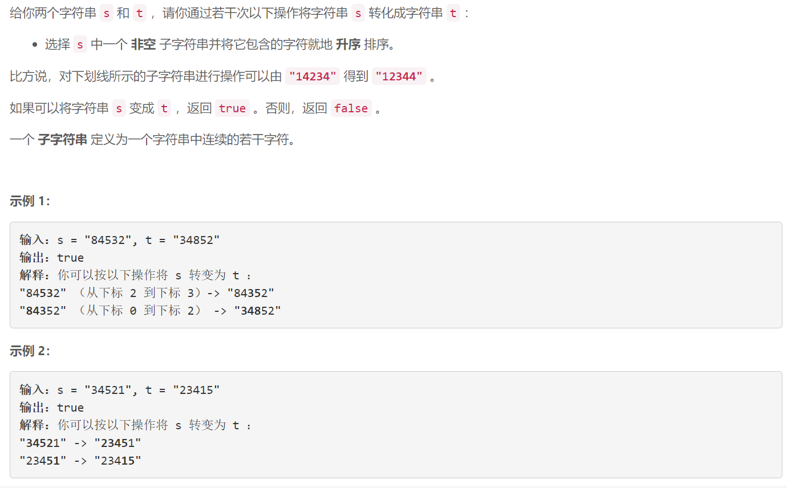
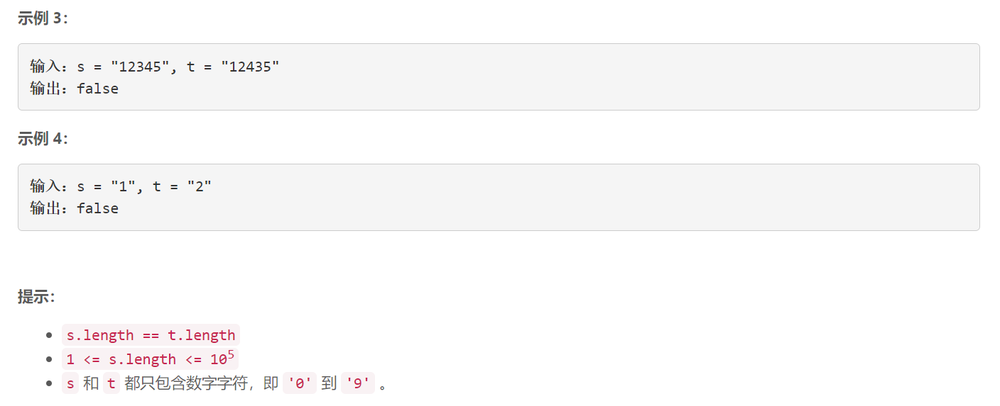

### 5514. 检查字符串是否可以通过排序子字符串得到另一个字符串

###      



## Java solution

```java
class Solution {
    // 如果s中两个元素是顺序的 a...b (a<b) 然而t中这两个元素是逆序的 b..a  那么无法通过排序操作将a移动到b后面 返回false
    // 其余情况 s     t
    //         a..b  a..b   无需操作
    //         b..a  a..b   s中a可以到b前面
    //         b..a  b..a   无需操作
    //遍历s中元素 假设当前数字是s[i]=b(第cnt次出现) 对应t中b也是第cnt出现 这两个数字是对应的 如果t中不存在这个数字 那么返回false
    //为了找到这个数字 用一个栈q[b]保存t中所有b出现的位置索引
    //每遍历一个数字b 将q[b]弹出最前面的一个元素  
    //last[a] 表示在遍历到s的第i个元素   t中出现数字a第cnt次的位置索引 (注意s中数字也是出现第cnt次 因为二者是一一对应的)
    public boolean isTransformable(String s, String t) {
        Queue<Integer>[] q=new Queue[10];
        for(int i=0;i<10;i++)q[i]=new LinkedList<>();
        int[] last=new int[10];
        char[] s1=s.toCharArray();
        char[] t1=t.toCharArray();
        int n=t1.length;
        for(int i=0;i<n;i++)q[(int)(t1[i]-'0')].offer(i);
        for(int i=0;i<n;i++)
        {
            int b=(int)(s1[i]-'0');
            if(q[b].isEmpty()) return false;//t中不存在数字num 返回false
            last[b]=q[b].poll();
            //比b小的数a在t中上一次出现的位置是last[a] 这个值只有在s中出现a才会被修改 说明s中a在b之前出现 但是t中a在b之后 所以返回false
            for(int a=0;a<b;a++)
            {
                if(last[a]>last[b]) return false;
            }
        }
        return true;
    }
    
}
```


