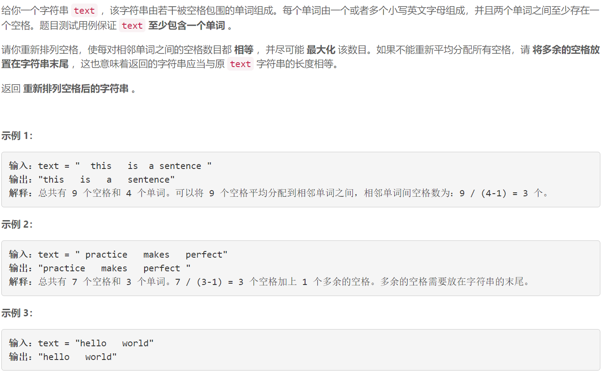
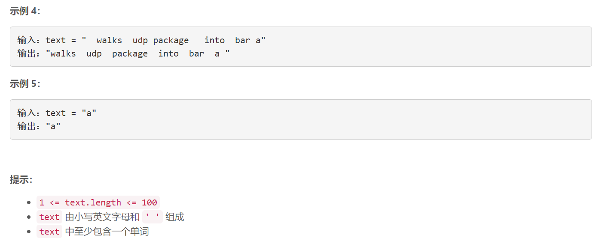

### 5519. 重新排列单词间的空格

### 

###       

## Java solution

```java
class Solution {
    public String reorderSpaces(String text) {
        List<String> l=new ArrayList<>();
        int cnt=0;
        String cur="";
        char[] t=text.toCharArray();
        for(int i=0;i<t.length;i++)
        {
            if(t[i]==' ')
            {
                if(i>0 && t[i-1]!=' ')
                {
                    l.add(cur);
                    cur="";
                }
                cnt++;
            }
            else
            {
                cur+=t[i];
                if(i==t.length-1)l.add(cur);
            }
            
        }
         int len,res;
         String ans="";
        if(l.size()==1)
        {
             len=0;
             res=cnt;
        }
        else
        {
             len=cnt/(l.size()-1);
             res=cnt%(l.size()-1);
        }

       
        for(int i=0;i<l.size()-1;i++)
        {
            ans+=l.get(i);
            for(int j=0;j<len;j++) ans+=' ';
        }
        ans+=l.get(l.size()-1);
        for(int i=0;i<res;i++) ans+=' ';
        return ans;
    }
}

```