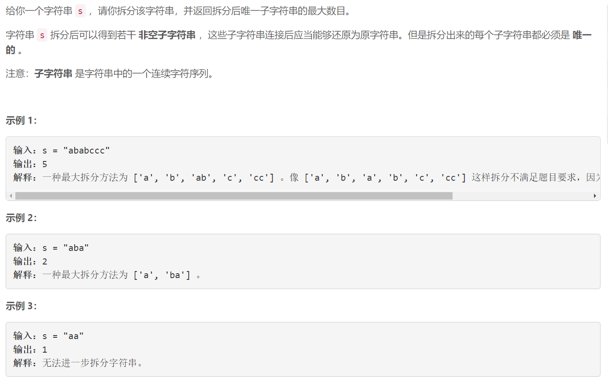
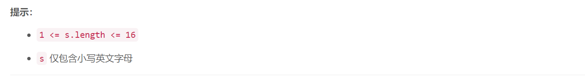

### 5520. 拆分字符串使唯一子字符串的数目最大


    



## Java solution 

```java
class Solution {
    int[] dp;
    int res=0;
    public int maxUniqueSplit(String s) {
       int n=s.length(); 
         dfs(s,0,new HashSet<>());
         return res;
    }
    private void dfs(String s,int i,Set<String> set)
    {
        int n=s.length();
        if(n==i) 
        {
            res=Math.max(set.size(),res);
            return ;
        }
        
        for(int j=i+1;j<=n;j++)
        {
            String cur=s.substring(i,j);
            if(set.contains(cur))continue;
            set.add(cur);
            dfs(s,j,set);
            set.remove(cur);
        }
       
    }
}
```

