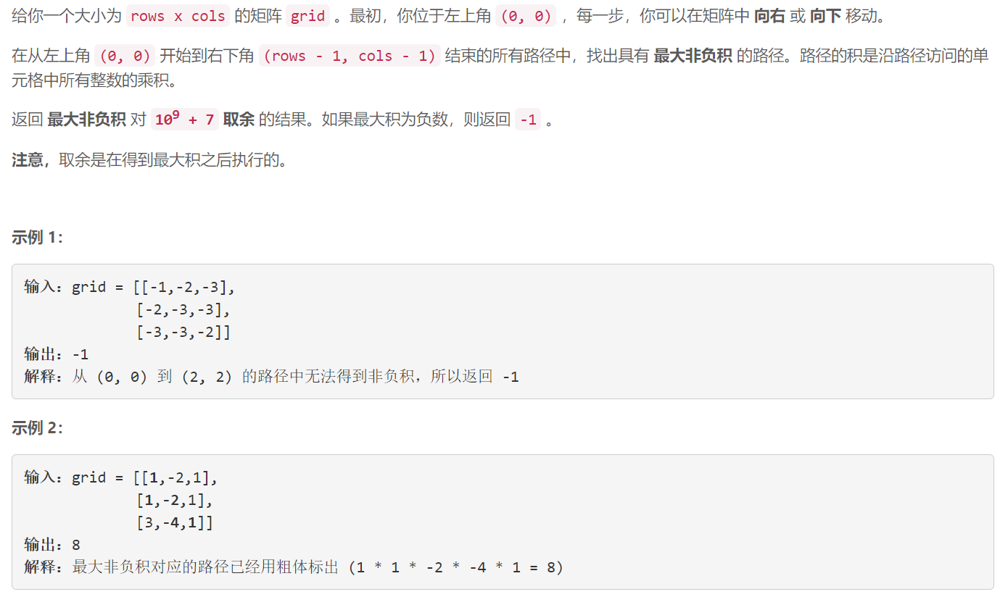
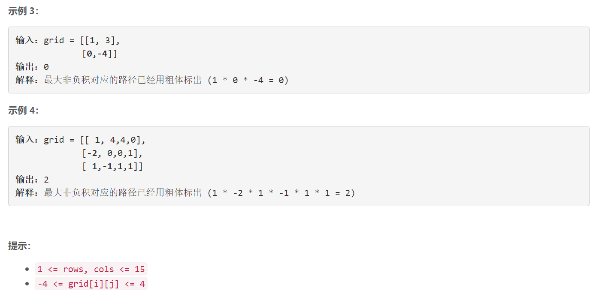
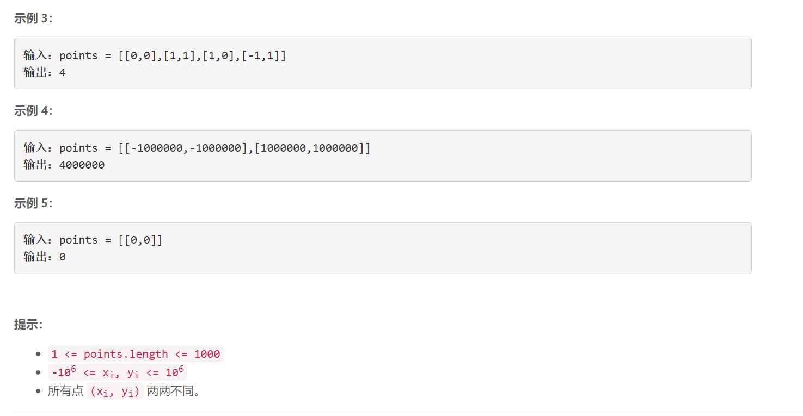

### 5513. 连接所有点的最小费用

  





## Java solution

```java
class Solution {
    long mod=(long)1e9+7;
    long res=-1;
    public int maxProductPath(int[][] grid) {
       int m=grid.length,n=grid[0].length ;
       long[][] g=new long[m][n];
        for(int i=0;i<m;i++)for(int j=0;j<n;j++)g[i][j]=(long)grid[i][j];
        dfs(g,0,0,g[0][0]);
        return res==-1?-1:(int)(res%mod);
    }
    void dfs(long[][] g,int i,int j,long path)
    {
        int m=g.length,n=g[0].length ;
        if((i==m-1 && j==n-1) || path==0 )
        {
            res=Math.max(res,path);
            return;
        }

        if(i+1<m) dfs(g,i+1,j,path*g[i+1][j]);
        if(j+1<n) dfs(g,i,j+1,path*g[i][j+1]);
    }
}
```