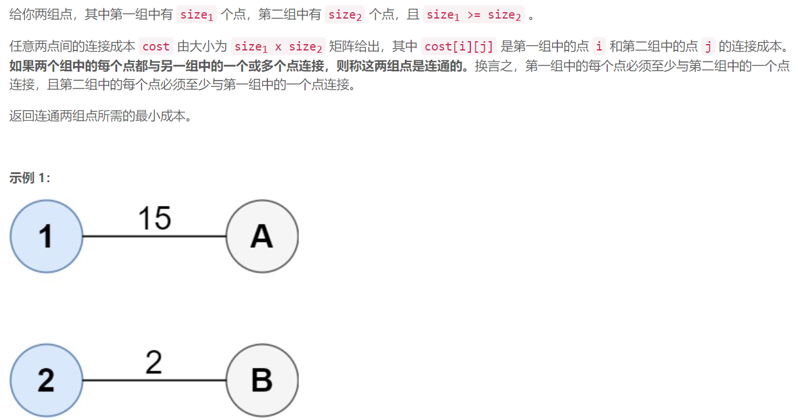
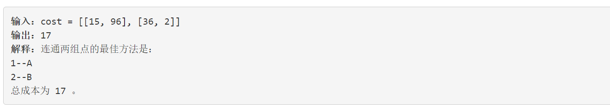
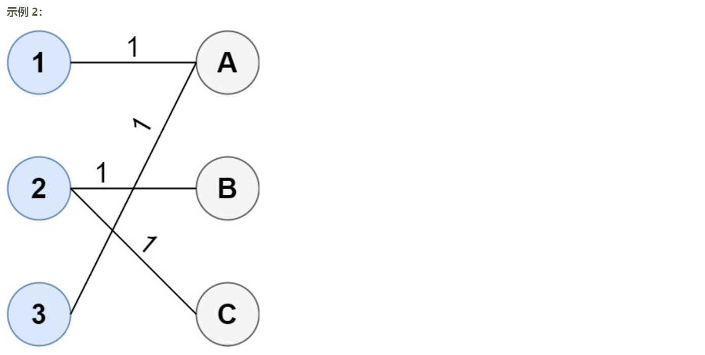
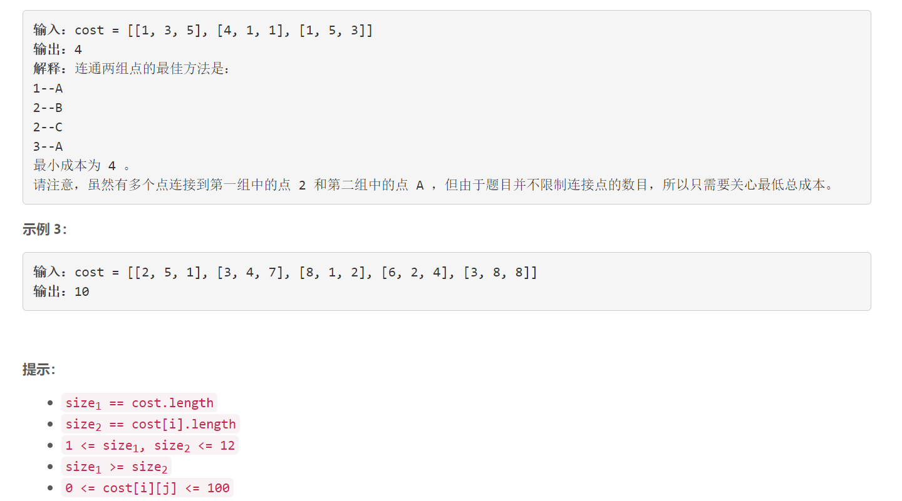

### 5522. 连通两组点的最小成本

###      







## Java solution

```java
class Solution {
    
    public int connectTwoGroups(List<List<Integer>> cost) {
        int m=cost.size(),n=cost.get(0).size();
        //一个size_1 * size_2的矩阵  每一行都要有元素被选择 每一列也都要有元素被选择
        int[][] dp=new int[m][1<<n];//dp[i][j] 表示选到第i行 列数的总体选择情况为j 
        int[][] sum=new int[m][1<<n];//sum[i][j] 表示选到第i行  在这一行中的列数选择情况为j
        for(int i=0;i<m;i++)
        {
            for(int j=1;j<(1<<n);j++)
            {
                for(int k=0;k<n;k++)
                {
                    if((j&(1<<k))>0)
                    {
                        sum[i][j]+=cost.get(i).get(k);
                    }
                }
            }
        }
        
        dp[0]=sum[0];
        for(int i=1;i<m;i++)Arrays.fill(dp[i],Integer.MAX_VALUE);
        for(int i=1;i<m;i++)for(int j=1;j<(1<<n);j++) for(int k=1;k<(1<<n);k++)
        {
            //这里状态j从1开始 sum[i][j] 在i这一行至少选择一个元素(j>0) 所以保证了每行都有元素被选中
            //k从1 开始 说明上一行选择结束之后至少有一列中的元素被选中
            dp[i][j|k]=Math.min(dp[i][j|k],dp[i-1][k]+sum[i][j]);
        }
        return dp[m-1][(1<<n)-1]; //所有列都要被选择
       
    }
   
}

```


