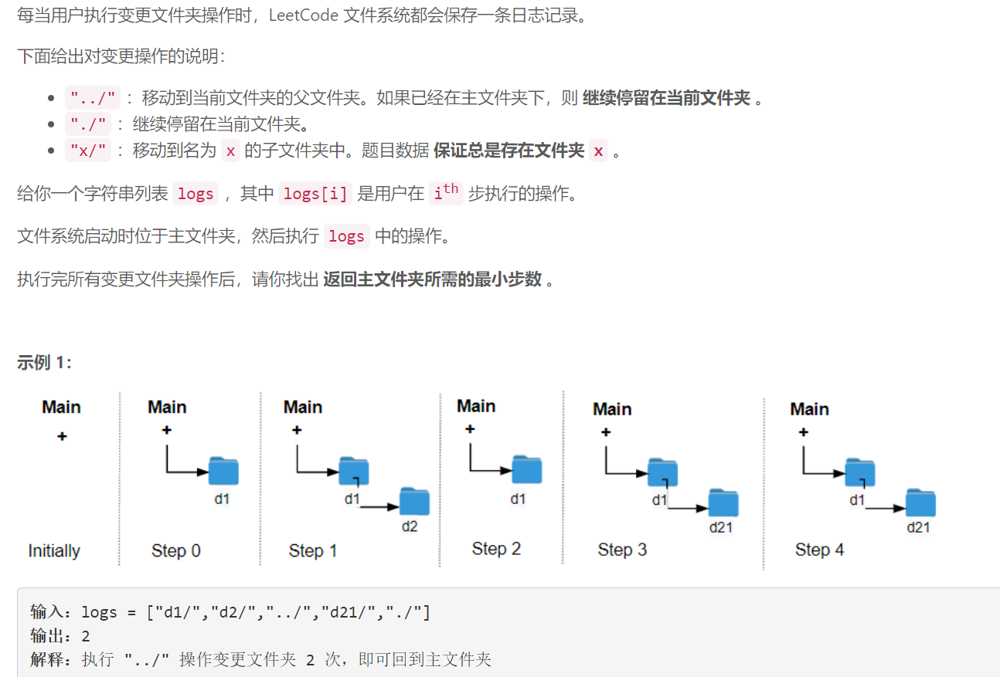
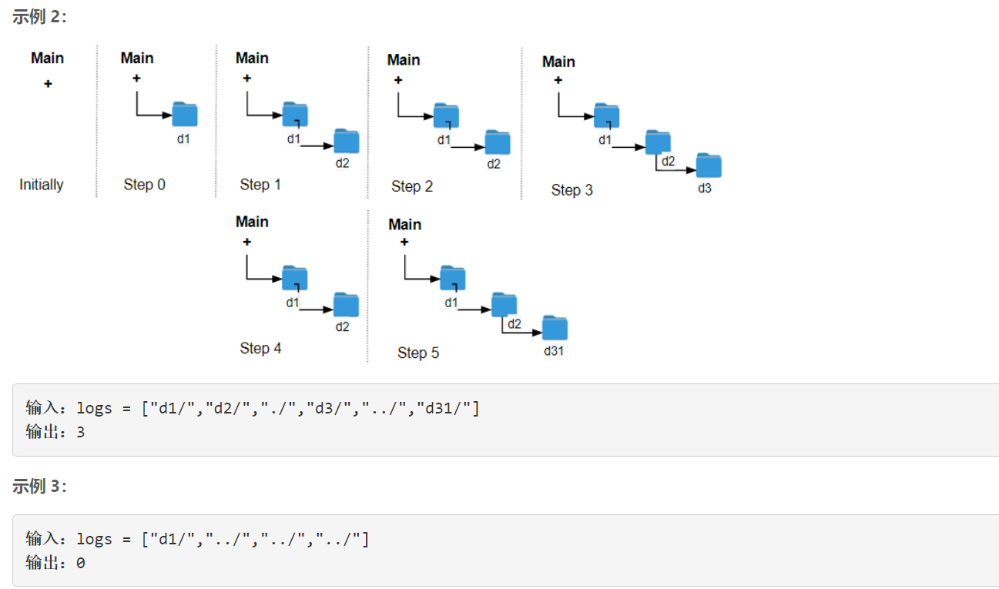

### 5523. 文件夹操作日志搜集器

### 

###       


## Java solution

```java
class Solution {
    public int minOperations(String[] logs) {
       int depth=0;
       for(String l:logs)
       {
           if(l.equals("../"))
           {
               depth=depth==0?0:depth-1;
           }
           else if(l.equals("./"))
           {
               
           }
           else 
           {
               depth++;
           }
       }
       return depth; 
    }
}

```