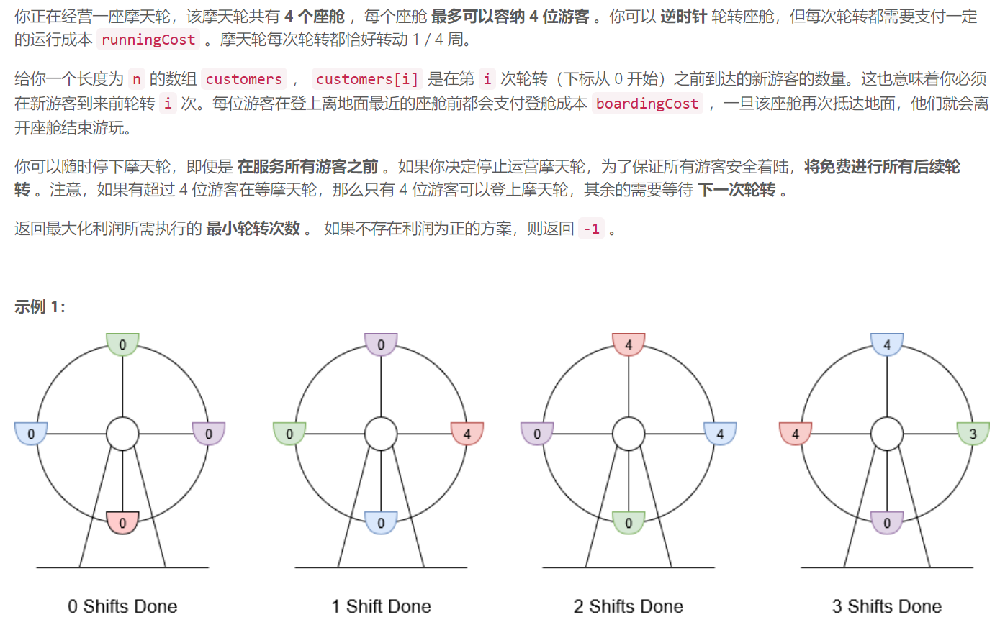
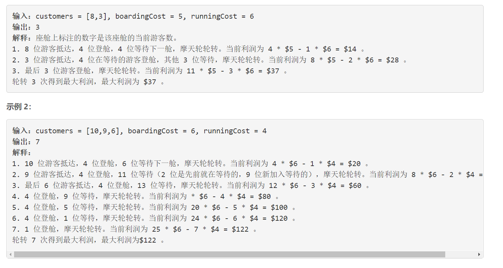
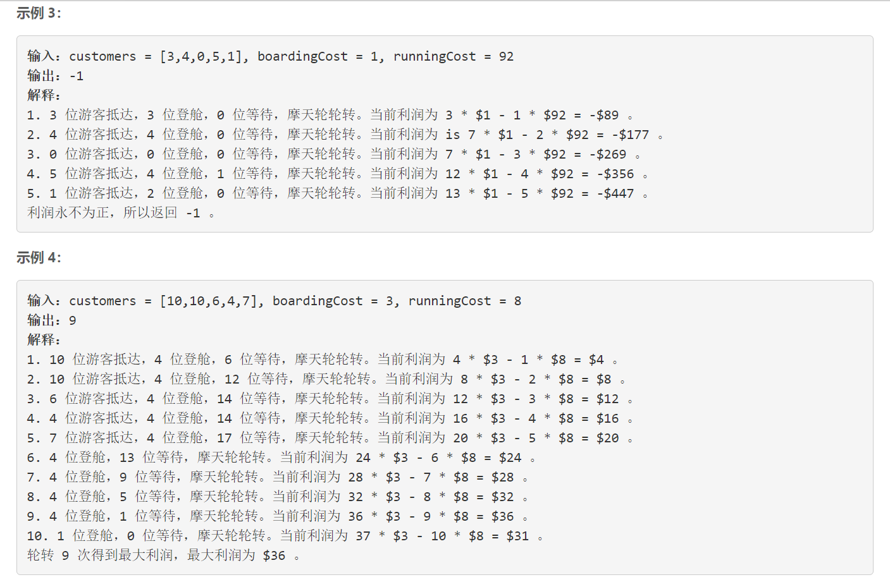
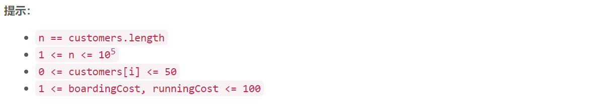

### 5524. 经营摩天轮的最大利润


    







## Java solution 

```java
class Solution {
    public int minOperationsMaxProfit(int[] customers, int boardingCost, int runningCost) {
        int idx=-1,n=customers.length,i=0,time=1;
        Queue<Integer> q=new LinkedList<>();
        int profit=0,maxProfit=0,num=0;
        while(num>0 || i<n)
        {
            if(i<n) num+=customers[i];
            if(num>=4)
            {
               profit+=4*boardingCost-runningCost;
                num-=4;     
           }
           else 
          {
              profit+=num*boardingCost-runningCost;
               num=0;
           }
            
            if(profit>maxProfit)
            {
               maxProfit=profit;
               idx=time;
           }
            i++;
            time++;
        }
        return idx;
    }
}
```

