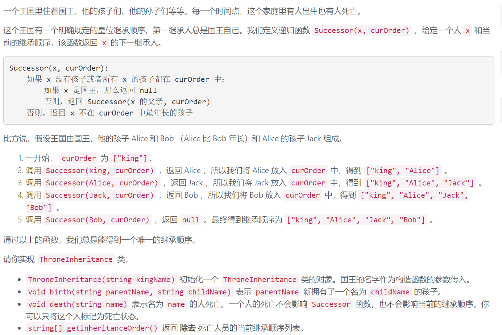
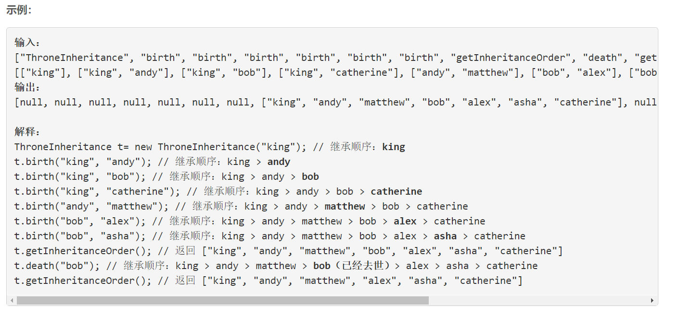
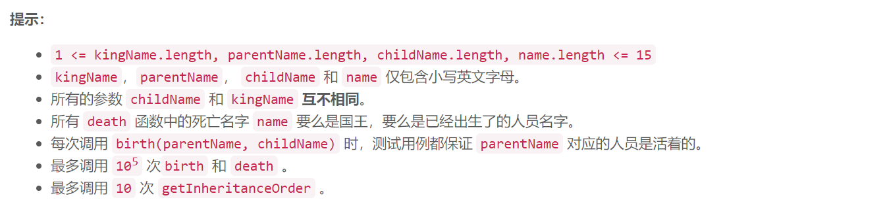

### 5525. 皇位继承顺序

  





## Java solution

```java
class ThroneInheritance {
    String king;
    HashMap<String,List<String>> map=new HashMap<>();
    HashMap<String,Boolean> death=new HashMap<>();
    public ThroneInheritance(String kingName) {
         king=kingName;  
         map.put(king,new LinkedList());
    }
    
    public void birth(String parentName, String childName) {
        List<String> p=map.get(parentName);
        p.add(childName);
        map.put(childName,new LinkedList());
    }
    
    public void death(String name) {
        death.put(name,true);
    }
    List<String> res;
    public List<String> getInheritanceOrder() {
       res=new ArrayList<>();
       helper(king); 
       return res; 
    }
    
    private void helper(String name)
    {
        if(!death.getOrDefault(name,false)) res.add(name);
        for(String k:map.get(name))
        {
            helper(k);
        }
    }
}


/**
 * Your ThroneInheritance object will be instantiated and called as such:
 * ThroneInheritance obj = new ThroneInheritance(kingName);
 * obj.birth(parentName,childName);
 * obj.death(name);
 * List<String> param_3 = obj.getInheritanceOrder();
 */
```