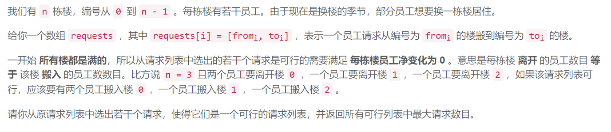
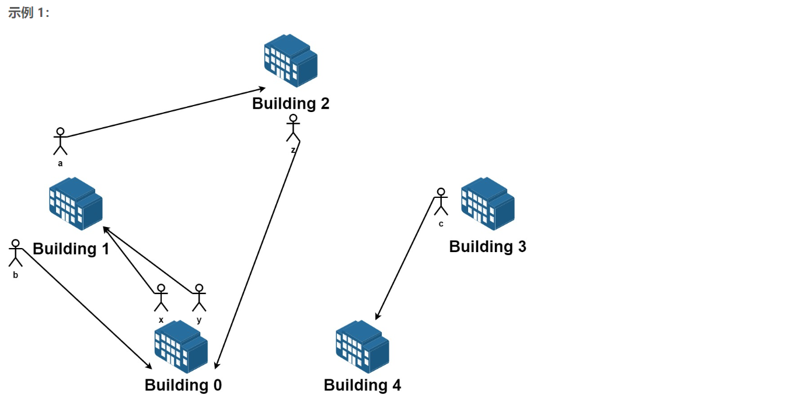
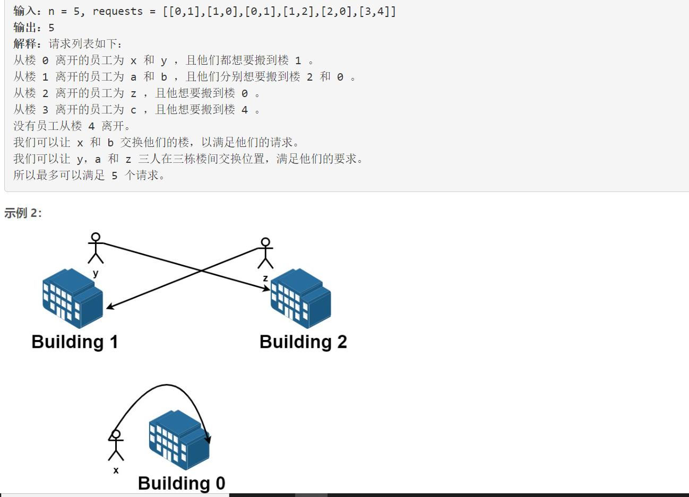
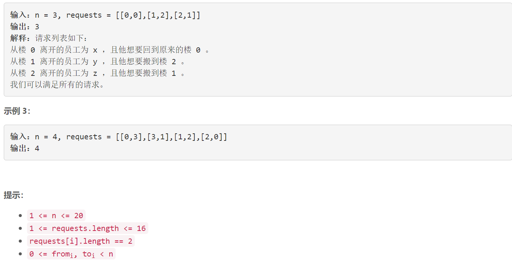

### 5526. 最多可达成的换楼请求数目

###      







## Java solution

```java
class Solution {
    int[] state;//state=0 未访问 state=1 当前正在访问 state=2 以构成环
    List<Integer>[] l;
    //将每一个建筑看成一个节点 将每个请求看成一个有向边  那么所有能构成环的边(请求)都是可行的请求
    public int maximumRequests(int n, int[][] requests) {
        int len=requests.length;
        int lim=1<<len;
        int res=0;
        int[] dp;
        for(int i=1;i<lim;i++)  //i是满足需求的状态 i的第j位为1 说明第j个需求被满足
        {
            dp=new int[n];//dp[i] 是第i座建筑的人数
            int cnt=0;
            for(int j=0,k=1;j<len;j++,k<<=1)
            {
                if((i&k)>0)
                {
                    dp[requests[j][0]]--;
                    dp[requests[j][1]]++;
                    cnt++;
                }
            }
            boolean flag=true;//能否满足每栋楼员工净变化为 0
            for(int d:dp)if(d!=0)
            {
                flag=false;
                break;
            }
            if(flag) res=Math.max(res,cnt);
        }
        return res;
    }

}
```


