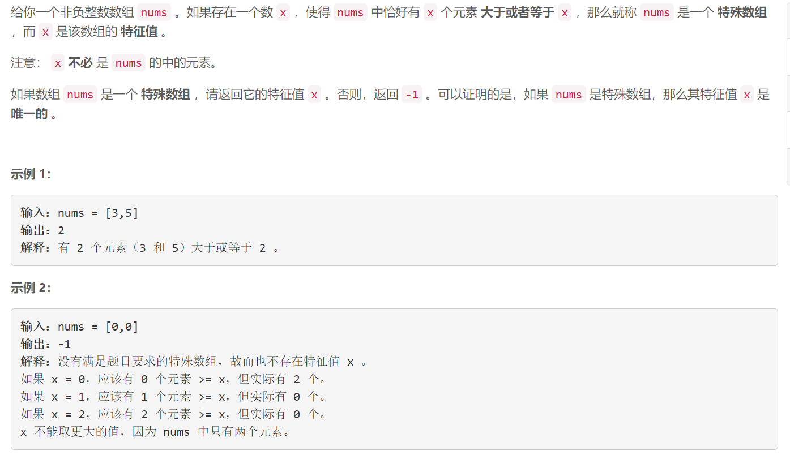
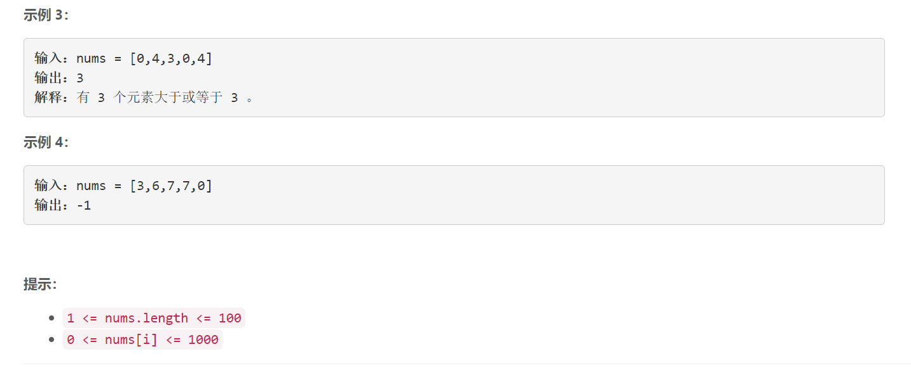

### 1608. 特殊数组的特征值

  



## Java solution

```java
class Solution {
    public int specialArray(int[] nums) {
        int n=nums.length;
        Arrays.sort(nums);
        if(nums[n-1]<0) return 0;
        if(nums[0]>=n) return n;
        for(int i=n-1,x=1;i>0;i--,x++)
        {
            if(nums[i]>=x && nums[i-1]<x) return x;
        }
        return -1;
    }
}
```