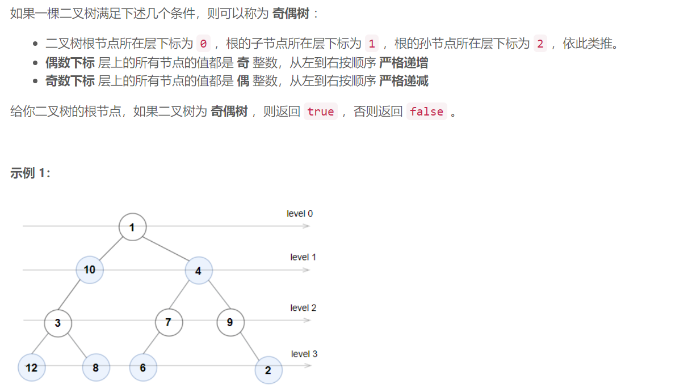
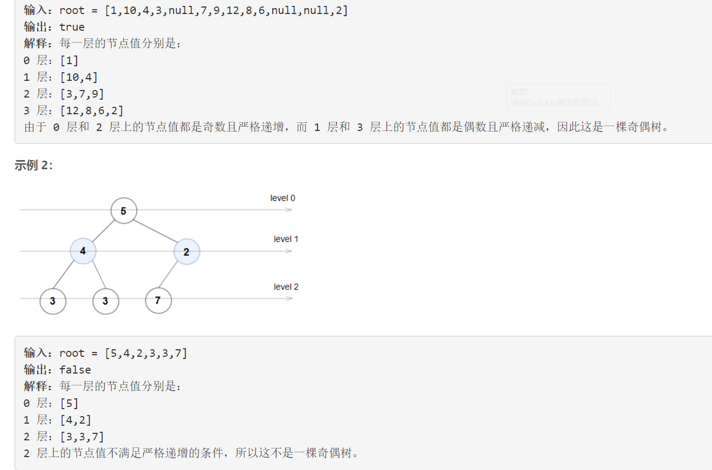
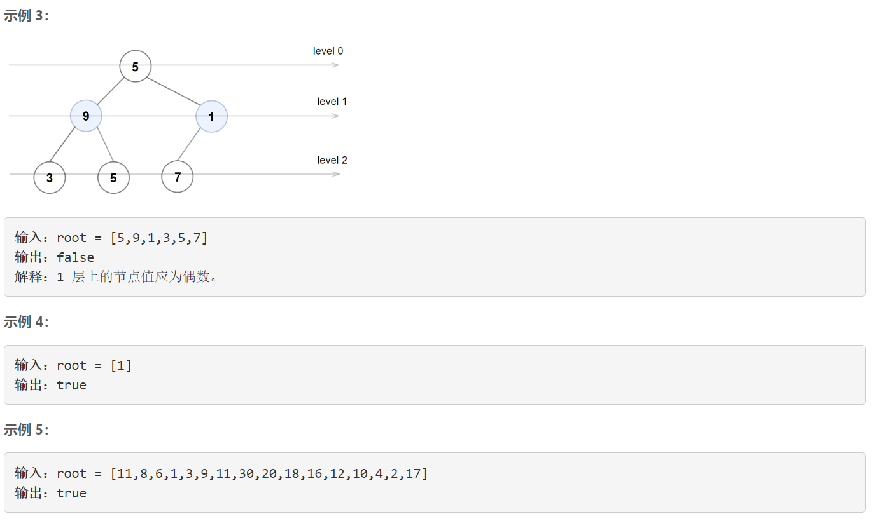

### 1609. 奇偶树


    






## Java solution 

```java
/**
 * Definition for a binary tree node.
 * public class TreeNode {
 *     int val;
 *     TreeNode left;
 *     TreeNode right;
 *     TreeNode() {}
 *     TreeNode(int val) { this.val = val; }
 *     TreeNode(int val, TreeNode left, TreeNode right) {
 *         this.val = val;
 *         this.left = left;
 *         this.right = right;
 *     }
 * }
 */
class Solution {
    public boolean isEvenOddTree(TreeNode root) {
        Queue<TreeNode> q=new LinkedList<>();
        q.offer(root);
        boolean even=false;
        while(!q.isEmpty())
        {
            int size=q.size();
            TreeNode prev=q.poll();
            if(even && prev.val%2==1) return false;
            if(!even && prev.val%2==0) return false;
            if(prev.left!=null) q.offer(prev.left);
            if(prev.right!=null) q.offer(prev.right);
            for(int i=1;i<size;i++)
            {
                TreeNode cur=q.poll();
                if(even)
                {
                    if(cur.val%2==1 || cur.val>=prev.val) return false;
                    prev=cur;
                }
                else
                {
                    if(cur.val%2==0 || cur.val<=prev.val) return false;
                    prev=cur;
                }
                if(cur.left!=null) q.offer(cur.left);
                if(cur.right!=null) q.offer(cur.right);
                
            }
            even=!even;
        }
        return true;
    }
}
```

