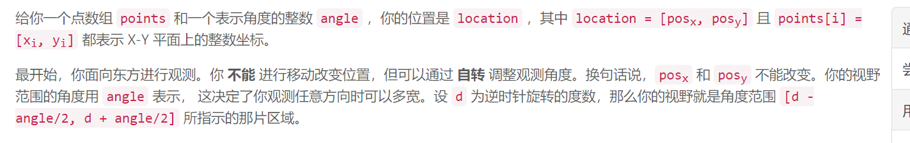
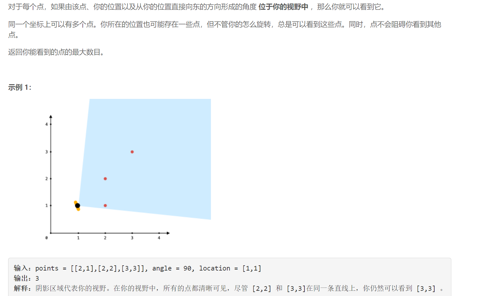
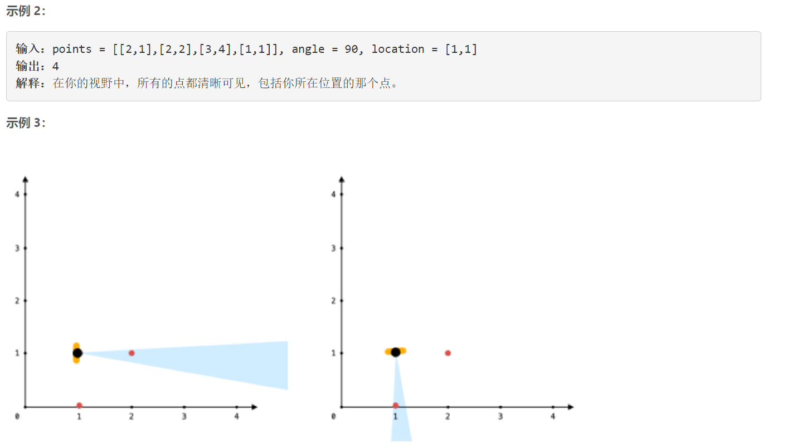
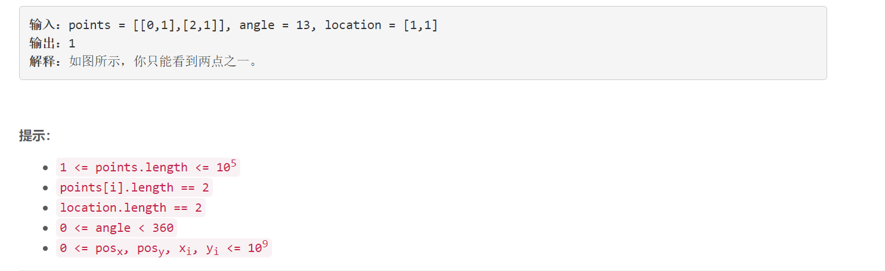

### 1610. 可见点的最大数目

### 

###       





## Java solution

```java
class Solution {
    public int visiblePoints(List<List<Integer>> points, int angle, List<Integer> location) {
       //按照极角排序
       double e=1e-8;
       List<Double> a=new ArrayList<>();

       int same=0;
       for(List<Integer> p:points)
       {
           if(p.get(0)==location.get(0) && p.get(1)==location.get(1)) same++;
           else a.add(Math.atan2(p.get(1)-location.get(1),p.get(0)-location.get(0))*180/Math.PI);//Math.atan2 返回的角度是以PI来表示的
       }
       Collections.sort(a);
       int n=a.size();
       //如果从点a左侧顺时针转angle度 那么从点a右侧顺时针转的角度是angle+360度
       for(int i=0;i<n;i++) a.add(a.get(i)+360);
       n=a.size();
       int res=0;
       for(int i=0,j=0;i<n&&j<n;i++)
       {
           while(j<n&&a.get(j)-a.get(i)<angle+e)j++;
           res=Math.max(j-i+same,res);
       }
       return res;
    }
}

```