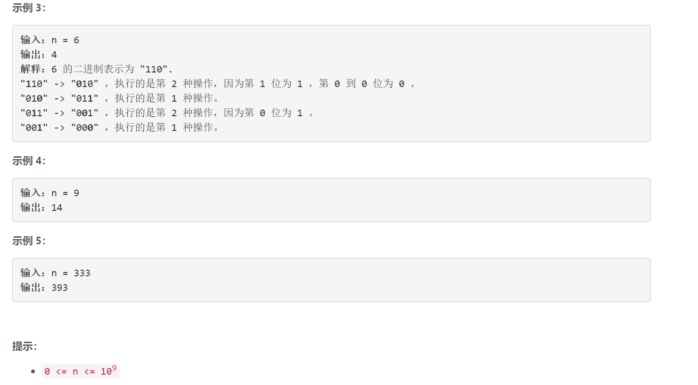

### 1611. 使整数变为 0 的最少操作次数

###      



## Java solution

```java
class Solution {
    // 1100 0100 0101 0111 0110 0010 0011 0001 0000
    //其实就是格雷码转二进制
    public int minimumOneBitOperations(int n) {
           int x=n;
           int y = x;
          x>>=1;
          while(x!=0)
          {
               
               y ^= x;
              x>>=1;
          }
           
          return y;
             
          
    }
}
```


