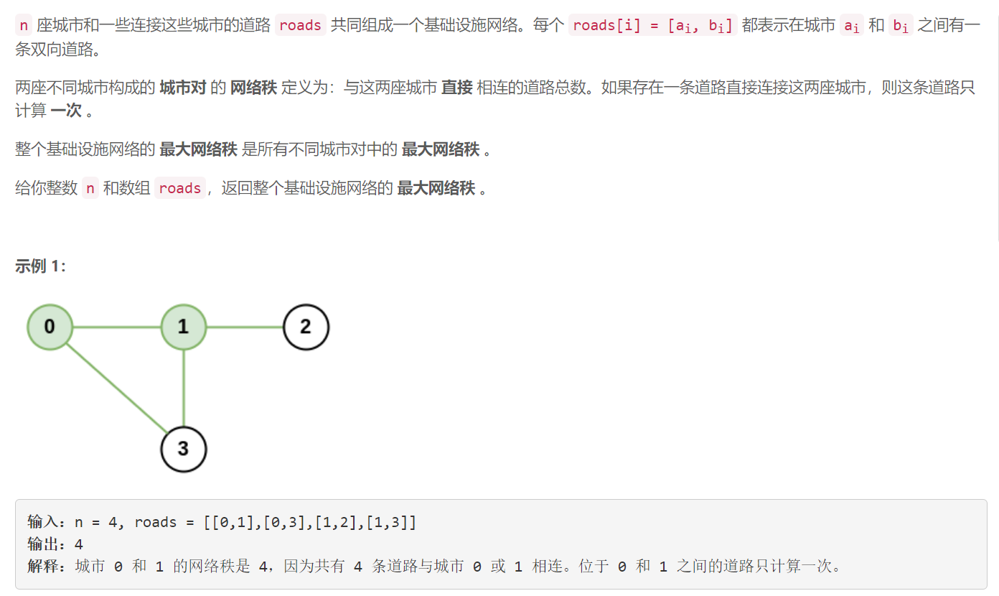
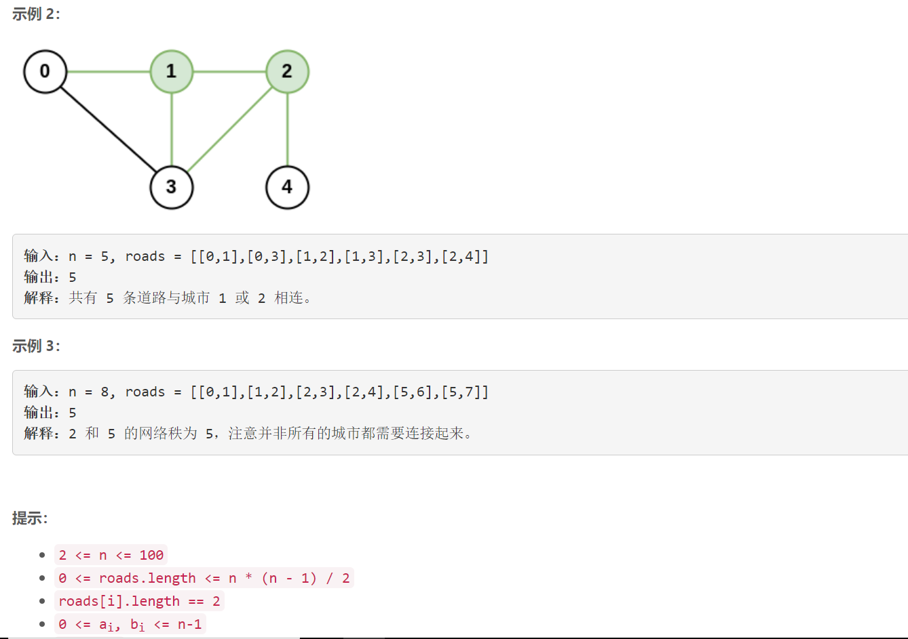

### 1615. 最大网络秩


    



## Java solution 

```java
class Solution {
    public int maximalNetworkRank(int n, int[][] roads) {
       //boolean[] f=new boolean[n];
       //int[] dp=new int[n];
       Set<Integer>[] s=new HashSet[n];
       for(int i=0;i<n;i++) s[i]=new HashSet<>(); 
       for(int[] r:roads)
       {
           s[r[0]].add(r[1]);
           s[r[1]].add(r[0]);
       }
       int res=0; 
       for(int i=0;i<n;i++)for(int j=i+1;j<n;j++)
       {
           if(s[i].contains(j)) res=Math.max(res,s[i].size()+s[j].size()-1);
           else  res=Math.max(res,s[i].size()+s[j].size());
       }
       return res;
    }
}
```

