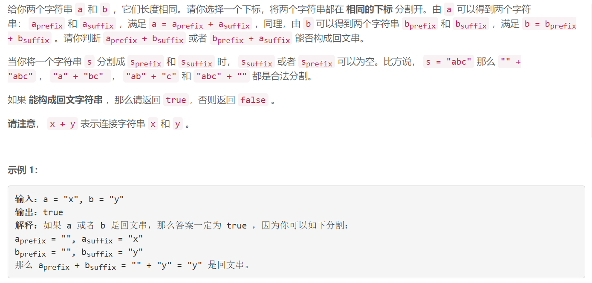
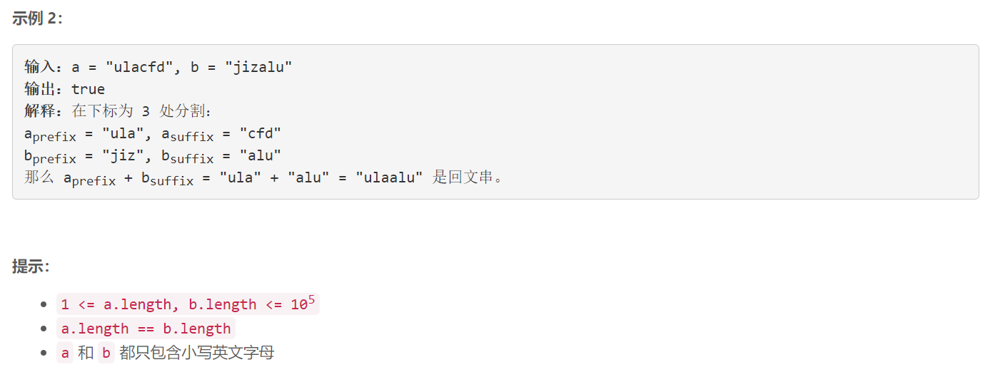

### 1616. 分割两个字符串得到回文串

### 

###       

## Java solution

```java
class Solution {
    public boolean checkPalindromeFormation(String a, String b) {
        return check(a.toCharArray(),b.toCharArray()) || check(b.toCharArray(),a.toCharArray()); 
    }
    private boolean check(char[] a,char[] b)
    {
        int n=a.length;
        boolean[] aa=new boolean[n];//aa[i]表示 a[i,center] a[center,center+center-i] 左右两部分是否能构成回文 
        boolean[] ab=new boolean[n];//ab[i]表示 a前(i+1)个字符 和 b后(i+1)个字符 是否相同
        boolean[] bb=new boolean[n];
        for(int i=0;i<n;i++)
        {
            if(a[i]==b[n-i-1]) ab[i]=true;
            else break;
        }
        for(int i=n/2-1;i>=0;i--)
        {
            if(a[i]==a[n-i-1]) aa[i]=true;
            else break;
        }
        for(int i=n/2-1;i>=0;i--)
        {
            if(b[i]==b[n-i-1]) bb[i]=true;
            else break;
        }
        if(n<=1 || aa[0] || bb[0]) return true;
        for(int i=0;i<n;i++)
        {
            if(ab[i])
            {
                if(n-2*(i+1)<=1) return true;
                if(i+1<n && (aa[i+1] || bb[i+1])) return true;
            }
        }
        return false;
    }
    
}

```