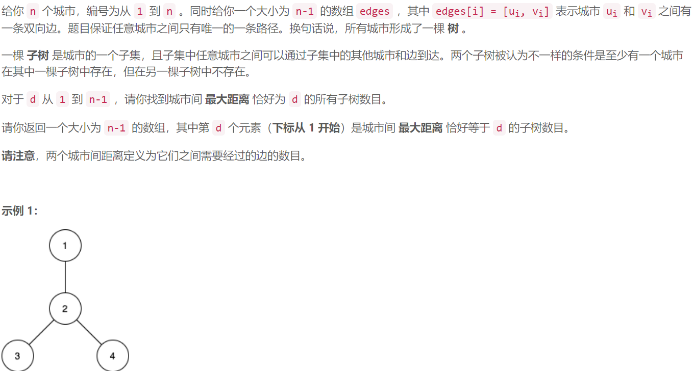
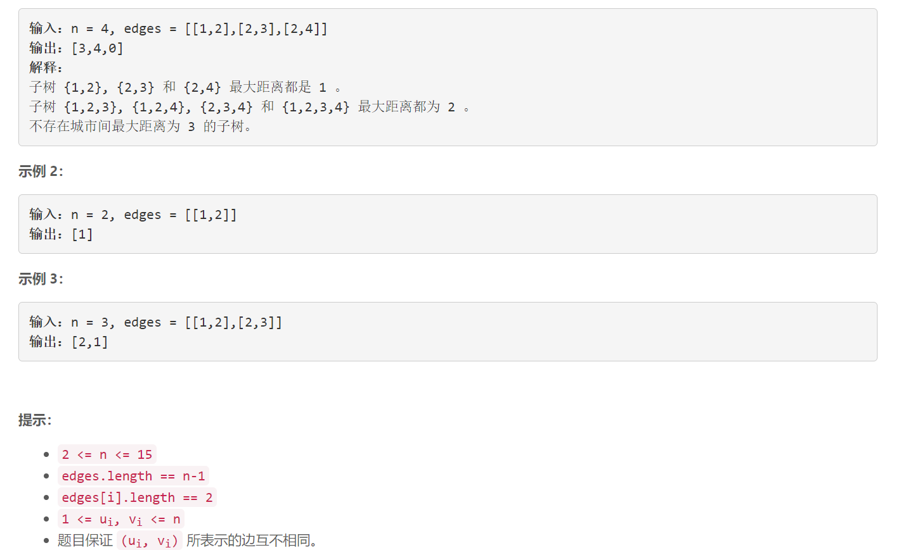

### 1617. 统计子树中城市之间最大距离

###      



## Java solution

```java
class Solution {
    List<Integer>[] l;
    public int[] countSubgraphsForEachDiameter(int n, int[][] edges) {
       l=new ArrayList[n];
       int[] res=new int[n-1];
       for(int i=0;i<n;i++) l[i]=new ArrayList<>();
       for(int[] e:edges)
       {
           l[e[0]-1].add(e[1]-1);
           l[e[1]-1].add(e[0]-1);
       }
       for(int i=0;i<(1<<n);i++)
       {
           if((i&(i-1))==0) continue;
           int d=maxd(i,n);
           if(d>0) res[d-1]++;
       }
       return res;
    }
    // mask0 城市集合 第i位为1 说明集合中有第(i+1)个城市
    private int maxd(int mask0,int n)
    {
        int res=0;
        for(int i=0;i<n;i++)
        {
            if(((1<<i)&mask0)!=0)
            {
                int dist=0,mask=mask0;
                Queue<Integer> pre=new LinkedList<>();
                Queue<Integer> cur=new LinkedList<>();
                pre.offer(i);
                //bfs遍历
                while(!pre.isEmpty())
                {
                    while(!pre.isEmpty())
                    {
                        int p=pre.poll();
                       mask^=(1<<p);//异或操作 将mask的第p位反转 
                       for(Integer j:l[p])
                       {
                        
                        if((mask&(1<<j))!=0)
                        {
                            cur.offer(j);
                        }
                       }
                    }
                    dist+=1;
                    pre=cur;
                    cur=new LinkedList<>();
                }
               
                if(mask>0) return 0;//由于maks中能够通过bfs到达的位置都通过异或操作反转为0 那么如果mask是有效的集合 那么mask此时应该==0 否则无效
                res=Math.max(res,dist-1);
            }
        }
        return res;
    }
}
```


