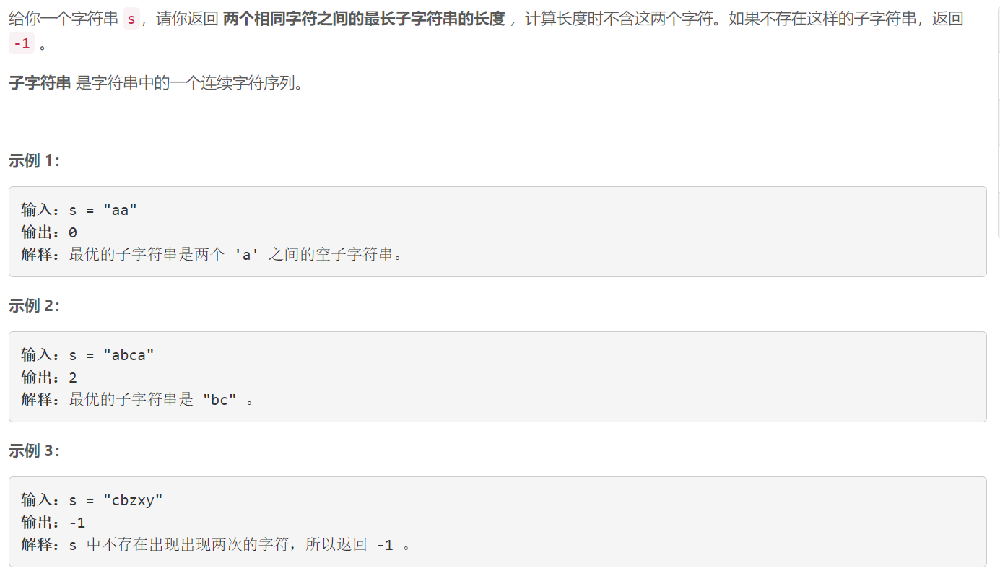
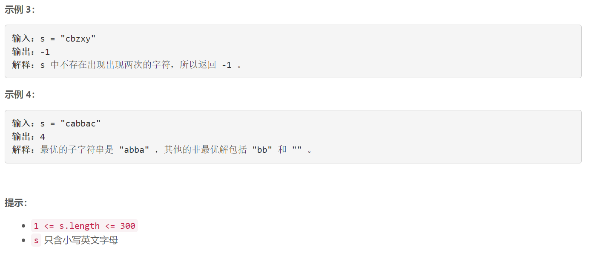

### 1624. 两个相同字符之间的最长子字符串时

  



## Java solution

```java
class Solution {
    public int maxLengthBetweenEqualCharacters(String s) {
        int[] start=new int[26];
        int[] end=new int[26];
        Arrays.fill(start,-1);
        for(int i=0;i<s.length();i++)
        {
            int idx=(int)(s.charAt(i)-'a');
            if(start[idx]==-1) start[idx]=i; 
            end[idx]=i;
        }
        int res=-1;
        for(int i=0;i<26;i++) if(start[i]!=-1)res=Math.max(res,end[i]-start[i]-1);
        return res;    
    }
}
```