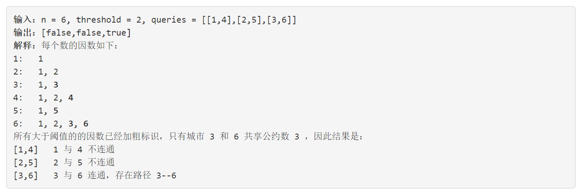

### 5128. 带阈值的图连通性

###      



## Java solution

```java
class Solution {
    int[] union;
    public List<Boolean> areConnected(int n, int threshold, int[][] queries) {
         List<Boolean> res=new ArrayList<>();
         if(threshold==0)
         {
             for(int i=0;i<queries.length;i++) res.add(true);
             return res;
         }
         union=new int[n+1];
         
         List<int[]> edges=new ArrayList<>();
         // 像8和12这种情况 由于二者都和4相连 所以不需要显式的将二者相连 因为在并查集的过程中会将二者指向相同的父节点
         for(int i=threshold+1;i<=n;i++) for(int j=2;j*i<=n;j++)
         {
             int[] e=new int[]{i,i*j};
             edges.add(e);
         }
        //System.out.print(edges.size()+" ");
         int[][] e=new int[edges.size()][2];
         for(int i=0;i<edges.size();i++) 
         {
             e[i][0]=edges.get(i)[0];
             e[i][1]=edges.get(i)[1];
         }
         unionFind(n,e);
         for(int[] q:queries)
         {
             //并查集结束后 如果所有节点是联通的 那么所有节点应该指向唯一root 
             if(findRoot(q[0])==findRoot(q[1]))
             {
                 res.add(true);
             }
             else res.add(false);
         }
         return res;    
    } 
    //并查集    
    private void unionFind(int n,int[][] edges)
    {
        for(int i=1;i<=n;i++) union[i]=i;
        for(int i=0;i<edges.length;i++)
        {
            int[] e=edges[i];
            int rootA=findRoot(e[0]);
            int rootB=findRoot(e[1]);
            //if(e[0]==4  && e[1]==12) System.out.print(rootA+" "+rootB+"\n");
            if(rootA!=rootB) //将两节点相连
            {
                union[rootA]=rootB;    
            }
        }
    }
    private int findRoot(int idx)
    {
        if(union[idx]!=idx)//返回idx所属集合的根结点
        {
           int root=findRoot(union[idx]);
           union[idx]=root;//路径压缩 直接将当前节点指向根结点 以缩短查询时间
           return root; 
        }    
        return idx;
    }
}
```


