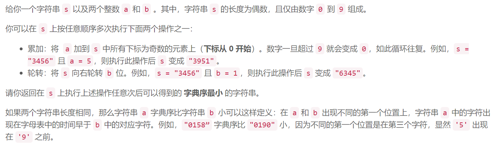
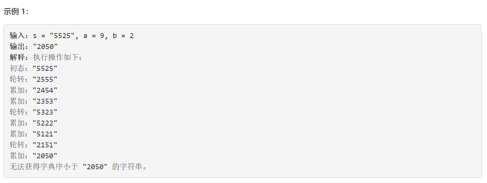
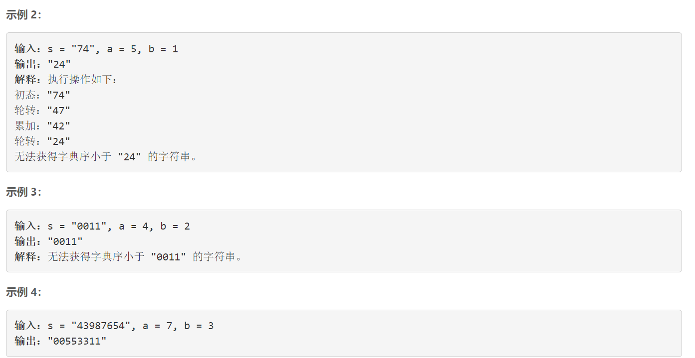
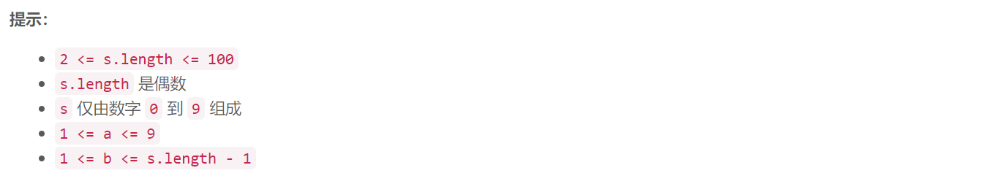

### 5544. 执行操作后字典序最小的字符串


    







## Java solution 

```java
class Solution {
    String res;
    Set<String> set;
    public String findLexSmallestString(String s, int a, int b) {
       res=s;
       set=new HashSet<>();
       dfs(s,a,b);
       return res;
    }
    private void dfs(String s,int a,int b)
    {
        if(cmp(s,res)) res=s;
        String s1=oa(s,a);
        if(!set.contains(s1))
        {
            set.add(s1);
            dfs(s1,a,b);
        }
        String s2=ob(s,b);
        if(!set.contains(s2))
        {
            set.add(s2);
            dfs(s2,a,b);
        }
    }
    private String oa(String s,int a)
    {
        char[] c=s.toCharArray();
        char[] c1=new char[c.length];
        for(int i=0;i<c.length;i++)
        {
            if(i%2==0) c1[i]=c[i];
            else 
            {
                int n=(int)(c[i]-'0');
                c1[i]=(char)(((n+a)%10)+'0');
            }
        }
        return String.valueOf(c1);
    }
    private String ob(String s,int b)
    {
        return s.substring(s.length()-b,s.length())+s.substring(0,s.length()-b);
    }
    private boolean cmp(String s1,String s2)
    {
        for(int i=0;i<s1.length();i++)
        {
            if(s1.charAt(i)<s2.charAt(i)) return true;
            if(s1.charAt(i)>s2.charAt(i)) return false;
        }
        return true;
    }
}
```

