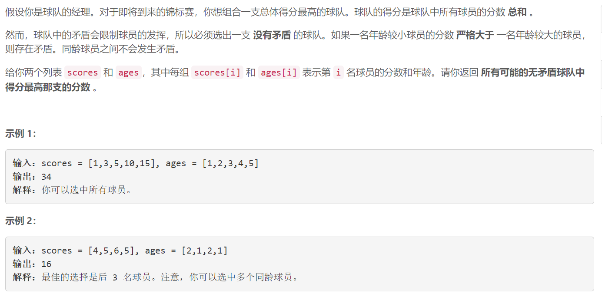
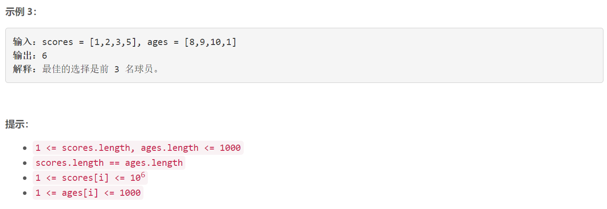

### 5545. 无矛盾的最佳球队

### 

###       

## Java solution

```java
class Solution {
    public int bestTeamScore(int[] scores, int[] ages) {
       // dp[i] 是必须选择球员p[i] 同时没有矛盾的最大分数和
        int n=scores.length;
        Player[] p=new Player[n];
        for(int i=0;i<n;i++)
        {
            p[i]=new Player(scores[i],ages[i]);
        }
        Arrays.sort(p);
        int[] dp=new int[n];
        for(int i=0;i<n;i++)
        {
            dp[i]+=p[i].s;
            int cur=0;
            for(int j=i-1;j>=0;j--)
            {
                if(p[i].a>p[j].a && p[i].s<p[j].s) continue;
                cur=Math.max(cur,dp[j]);
            }
            dp[i]+=cur;
        }
        int res=0;
        for(int i=0;i<n;i++) res=Math.max(res,dp[i]);
        return res;
    }
}

public class Player implements Comparable<Player> {
    int s;
    int a;

    public Player(int score, int age) {
        this.s = score;
        this.a = age; 
    }

    @Override
    public int compareTo(Player o) {
        if(a==o.a) return s-o.s;
        return a-o.a;
    }
 
}

```