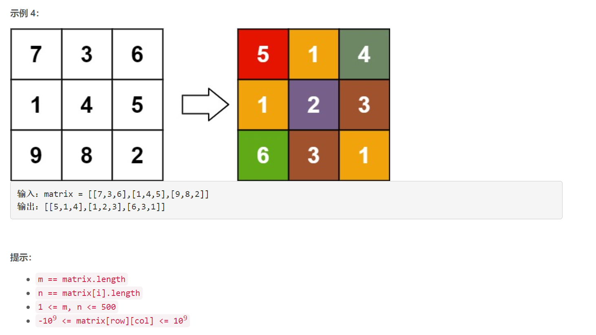

### 1629. 按键持续时间最长的键


    




## Java solution 

```java
class Solution {
    public char slowestKey(int[] releaseTimes, String keysPressed) {
        int[] dp=new int[26];
        int prev=0;
        int max=0;
        for(int i=0;i<releaseTimes.length;i++)
        {
            int idx=(int)(keysPressed.charAt(i)-'a');
            dp[idx]=Math.max(dp[idx],releaseTimes[i]-prev);
            max=Math.max(max,dp[idx]);
            prev=releaseTimes[i];
        }
        char c='a';
        for(int i=25;i>=0;i--)
        {
            if(dp[i]==max) 
            {
                c=(char)(i+'a');
                break;
            }
        }
        return c;
    }
}
```

