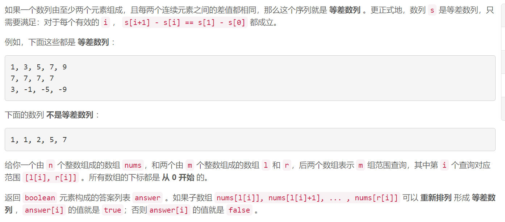
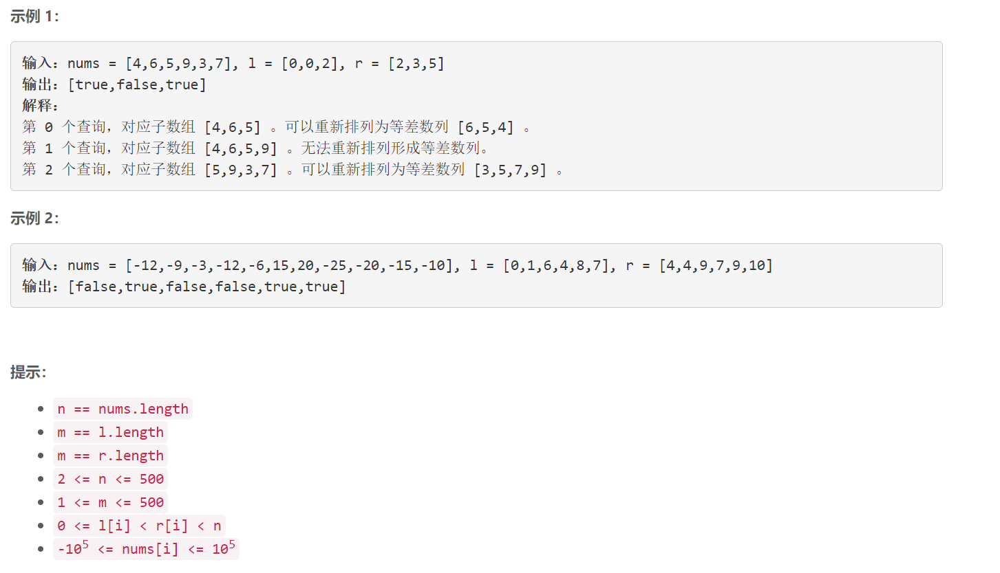

### 1630. 等差子数组

###      



## Java solution

```java
class Solution {
    public List<Boolean> checkArithmeticSubarrays(int[] nums, int[] l, int[] r) {
         List<Boolean> res=new ArrayList<>();
         for(int i=0;i<l.length;i++)
         {
             int[] n=nums.clone();
             res.add(check(n,l[i],r[i]));
         }
         return res;
    }
    private boolean check(int[] nums,int l,int r)
    {
        Arrays.sort(nums, l, r+1);
        //for(int i=l;i<=r;i++) System.out.print(nums[i]+"\n");
        //System.out.print("\n");
        int d=nums[l+1]-nums[l];
        for(int i=l+2;i<=r;i++)
        {
            //System.out.print(nums[i]+" "+nums[i-1]+" "+d+"\n");
            if(nums[i]-nums[i-1]!=d) return false;
        }
        return true;
    }
    
}
```


