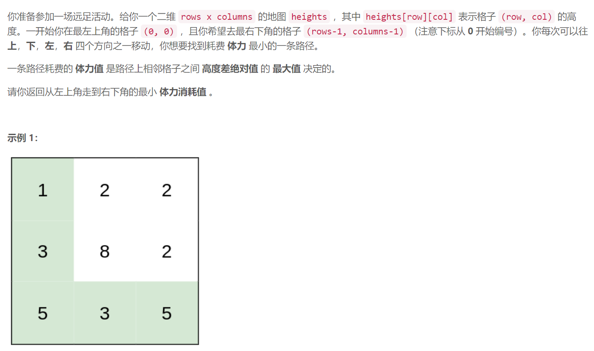

### 1631. 最小体力消耗路径

  


## Java solution

```java
class Solution {
    //bfs
    int max=(int)1e6+5;
    int[] d={-1,0,1,0,-1};
    public int minimumEffortPath(int[][] heights) {
        int m=heights.length,n=heights[0].length;
        int[][] f=new int[m][n];
        for(int i=0;i<m;i++)Arrays.fill(f[i],max);
        Queue<Integer> q=new LinkedList<>();
        f[0][0]=0;
        q.offer(0);
        while(!q.isEmpty())
        {
           int num=q.poll();
           int x=num/n,y=num%n;
           for(int i=0;i<4;i++)
           {
               int a=x+d[i],b=y+d[i+1];
               if(a>=0 && a<m && b>=0 && b<n)
               {
                   int cur=Math.max(f[x][y],Math.abs(heights[x][y]-heights[a][b]));
                   if(cur>=f[a][b]) continue;
                   f[a][b]=cur;
                   q.offer(a*n+b);
               }
           }
        }
        return f[m-1][n-1];
    }
}
```