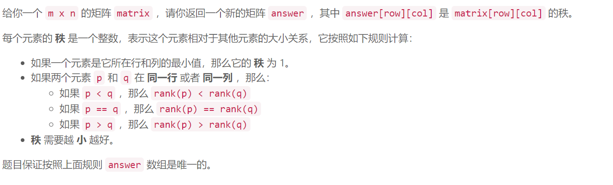
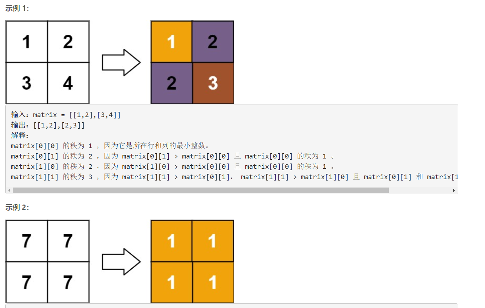
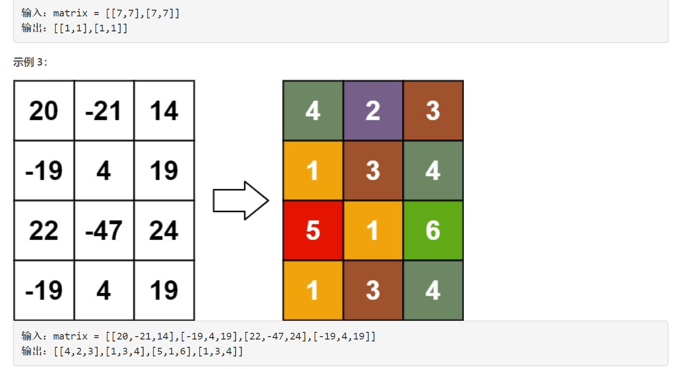
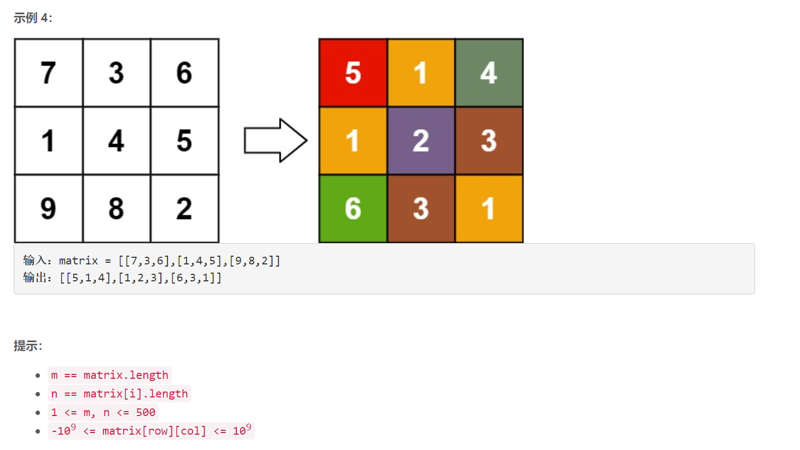

### 1632. 矩阵转换后的秩

### 

###       





## Java solution

```java
class Solution {
    public int[][] matrixRankTransform(int[][] matrix) {
       int m=matrix.length,n=matrix[0].length; 
       UnionFind uf=new UnionFind(m*n);
       //将同一行相同的值相连
       for(int i=0;i<m;i++)
       {
           HashMap<Integer,List<Integer>> map=new HashMap<>();
           for(int j=0;j<n;j++)
           {
               List<Integer> cur=map.getOrDefault(matrix[i][j],new ArrayList<>());
               cur.add(i*n+j);
               map.put(matrix[i][j],cur);
           }
           for(Integer num:map.keySet())
           {
               List<Integer> l=map.get(num);
               
               for(int k=0;k<l.size()-1;k++) 
               {
                   
                   uf.connect(l.get(k),l.get(k+1));
               }
           }
       }
       //将同一列相同的值相连
       for(int j=0;j<n;j++)
       {
           HashMap<Integer,List<Integer>> map=new HashMap<>();
           for(int i=0;i<m;i++)
           {
               List<Integer> cur=map.getOrDefault(matrix[i][j],new ArrayList<>());
               cur.add(i*n+j);
               map.put(matrix[i][j],cur);
           }
           for(Integer num:map.keySet())
           {
               List<Integer> l=map.get(num);
               for(int k=0;k<l.size()-1;k++) 
               {
                   uf.connect(l.get(k),l.get(k+1));
               }
           }
       }
       // 将同一行中大小相邻元素相连
       List<Integer>[] adj=new List[m*n];
       for(int i=0;i<m;i++) for(int j=0;j<n;j++) adj[i*n+j]=new ArrayList<>();
       int[] indegree=new int[m*n];
       for(int i=0;i<m;i++)
       {
          int[][] v=new int[n][2];
          for(int j=0;j<n;j++) 
          {
              v[j][0]=matrix[i][j];
              v[j][1]=j;
          } 
          Arrays.sort(v,(a,b)->a[0]-b[0]);
          for(int j=0;j<n-1;j++)
          {
              if(v[j][0]!=v[j+1][0])
              {
                  int a=uf.findRoot(i*n+v[j][1]);
                  int b=uf.findRoot(i*n+v[j+1][1]);
                  adj[a].add(b);
                  indegree[b]++;
              }
          }
       }
      
       // 将同一列中大小相邻元素相连
       for(int j=0;j<n;j++) 
       {
          int[][] v=new int[m][2];
          for(int i=0;i<m;i++)
          {
              v[i][0]=matrix[i][j];
              v[i][1]=i;
          } 
          Arrays.sort(v,(a,b)->a[0]-b[0]);
          for(int i=0;i<m-1;i++)
          {
              if(v[i][0]!=v[i+1][0])
              { 
                  int a=uf.findRoot(v[i][1]*n+j);
                  int b=uf.findRoot(v[i+1][1]*n+j);
                  adj[a].add(b);
                  indegree[b]++;
              }
          }
       }
       int[] ans=new int[m*n];
       Arrays.fill(ans,1);
       Queue<Integer> q=new LinkedList<>();
       //将根节点入队列
       for(int i=0;i<m*n;i++)
       {
           if(uf.findRoot(i)==i && indegree[i]==0) q.offer(i);
       }
       // bfs
       while(!q.isEmpty())
       {
           int a=q.poll();
           for(Integer b:adj[a])
           {
               ans[b]=Math.max(ans[b],ans[a]+1);
               indegree[b]--;
               if(indegree[b]==0) 
               {
                   q.offer(b);
               }
           }
       }
       int[][] res=new int[m][n];
       for(int i=0;i<m;i++) for(int j=0;j<n;j++)
       {
           res[i][j]=ans[uf.findRoot(i*n+j)];
       }
       return res;
    }
}

class UnionFind
{
    int n;
    int[] parent,size;
    UnionFind(int n)
    {
        this.n=n;
        parent=new int[n];
        size=new int[n];
        for(int i=0;i<n;i++) 
        {
            size[i]=1;
            parent[i]=i;
        }
    }
    int findRoot(int idx)
    {
        if(parent[idx]==idx) return idx;
        return parent[idx]=findRoot(parent[idx]);
    }
    
    void connect(int a,int b)
    {
        int pa=findRoot(a),pb=findRoot(b);
        if(pa!=pb)
        {
            if(size[pa]>size[pb])
           {
            parent[pb]=pa;//这里一定要注意将根节点相连
            size[pa]+=size[pb];
           }
           else
           {
            parent[pa]=pb;
            size[pb]+=size[pa];
           }
        }
    }
}

```