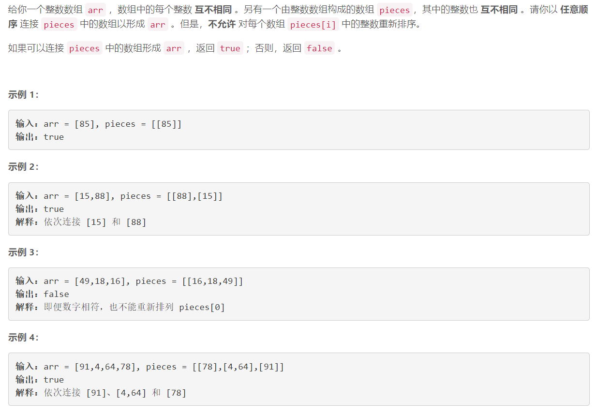

### 5554. 能否连接形成数组

###     


## Java solution 

```java
class Solution {
    public boolean canFormArray(int[] arr, int[][] pieces) {
        for(int i=0;i<arr.length;)
        {
            boolean flag=false;
            for(int[] p:pieces)
            {
                if(arr[i]==p[0])
                {
                    int j=1;
                    for(j=1;j<p.length;j++) if(arr[i+j]!=p[j]) return false;
                    flag=true;
                    i+=j;
                    break;
                }
            }
            if(!flag) return false;
        }
        return true;
    }
}
```

