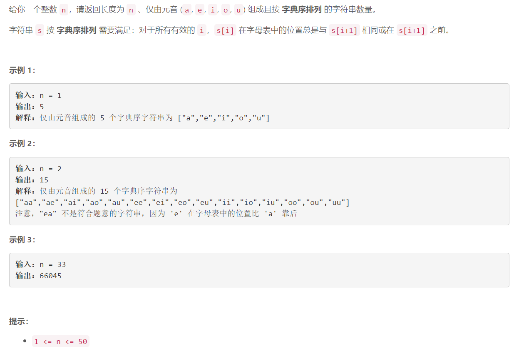

### 5555. 统计字典序元音字符串的数目

###      

## Java solution

```java
class Solution {
    public int countVowelStrings(int n) {
       int[] dp=new int[5];
       Arrays.fill(dp,1); 
       int res=5; 
       for(int i=1;i<n;i++)
       {
           res=0;
           int[] cur=new int[5];
           for(int j=0;j<5;j++)
           {
               res+=dp[j]*(5-j);
               for(int k=j;k<5;k++) cur[k]+=dp[j]; 
           }
           dp=cur;
       }
       return res; 
    }
}
```


