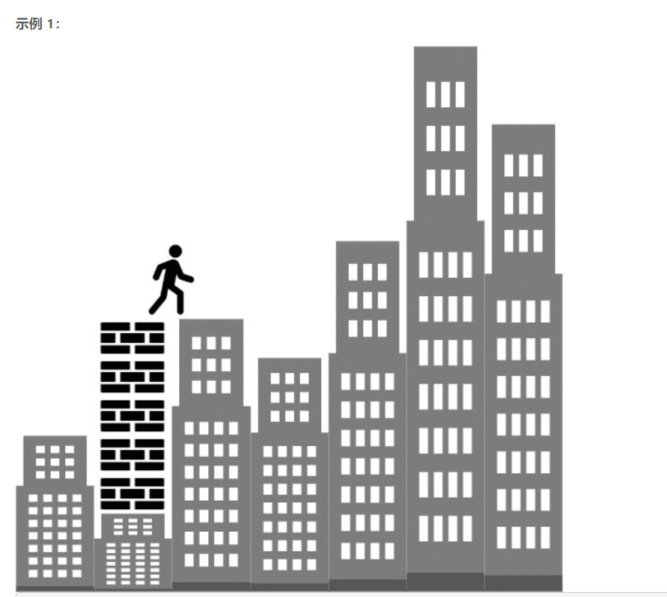

### 5556. 可以到达的最远建筑

  




## Java solution

```java
class Solution {
    public int furthestBuilding(int[] heights, int bricks, int ladders) {
         Queue<Integer> maxHeap=new PriorityQueue<Integer>((a,b)->b-a);
         int i;
         for(i=0;i<heights.length-1;i++)
         {
             if(heights[i]<heights[i+1])
             {
                 int cur=heights[i+1]-heights[i];
                 if(cur<=bricks)
                 {
                     maxHeap.offer(cur);
                     bricks-=cur;
                 }
                 else
                 {
                     if(ladders==0) break;
                     else
                     {
                         if(!maxHeap.isEmpty() && maxHeap.peek()>cur) 
                         {
                             ladders-=1;
                             bricks+=maxHeap.poll()-cur;
                         }
                         else
                         {
                             ladders-=1;
                         }
                     }
                 }
             }
         }
         return i;
    }
}
```