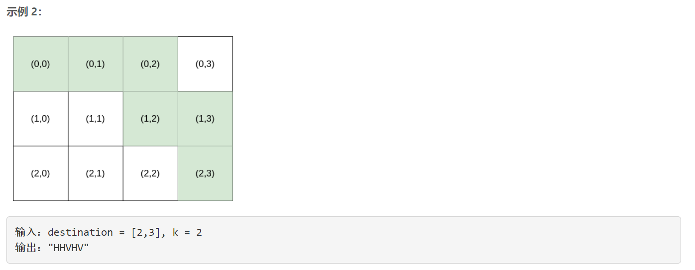

### 5600. 第 K 条最小指令

### 

###       




## Java solution

```java
class Solution {
    int[][] c=new int[35][20];
    public String kthSmallestPath(int[] destination, int k) {
        int r=destination[0],c=destination[1];
        int m=r+c,n=r;
        int[][] comb=combine(m,n);
        char[] res=new char[m];
        for(int i=0;i<m;i++)
        {
            if(n>0 && k>comb[m-i][n]-comb[m-i-1][n-1]) 
            {
                res[i]='V';
                k-=comb[m-i][n]-comb[m-i-1][n-1];
                n--;
            }
            else
            {
                if(c>0)
                {
                   res[i]='H';    
                    c--;
                }
                else 
                {
                    res[i]='V';
                    n--;
                }
                
            }
        }
        return String.valueOf(res);
    }
    // C(m,n)=C(m-1,n-1)+C(m-1,n)
    private int[][] combine(int m,int n)
    {
        int[][] c=new int[m+1][n+1];
        for(int i=0;i<m;i++) c[i][0]=1;
        for(int i=1;i<=m;i++) for(int j=1;j<=n;j++) c[i][j]=c[i-1][j-1]+c[i-1][j];
        return c;            
    }
}

```