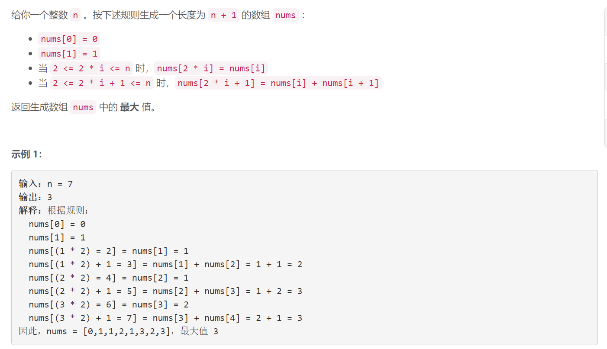
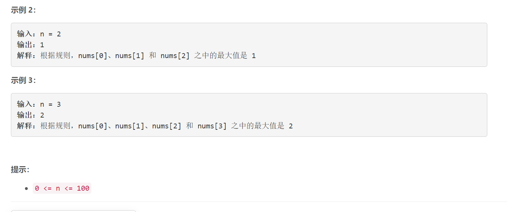

### 1646. 获取生成数组中的最大值

  



## Java solution

```java
class Solution {
    public int getMaximumGenerated(int n) {
        if(n==0) return 0;
        int[] nums=new int[n+1];
        nums[0]=0;
        nums[1]=1;
        int res=1;
        for(int i=2;i<=n;i++)
        {
            if(i%2==0) nums[i]=nums[i/2];
            else nums[i]=nums[i/2]+nums[i/2+1];
            res=Math.max(res,nums[i]);
        }
        return res;
    }
}
```