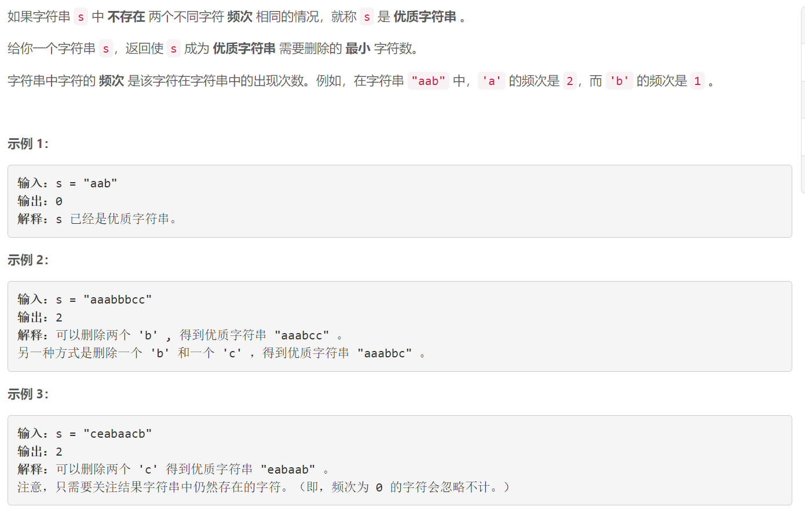
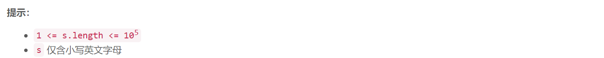

### 1647. 字符频次唯一的最小删除次数

###      



## Java solution

```java
class Solution {
    public int minDeletions(String s) {
       Map<Integer,Integer> map=new TreeMap<>();// (s中出现次数,对应字母数目)
       int[] cnt=new int[26];
       int res=0; 
       for(char c:s.toCharArray())
       {
           int cur=(int)(c-'a');
           cnt[cur]++;
       }
       Arrays.sort(cnt); 
       for(int i=24;i>=0;i--)
       {
           if(cnt[i]==0) continue;
           for(;cnt[i]>0 && cnt[i]>=cnt[i+1];cnt[i]--,res++);      
       } 
       return res; 
        
    }

}
```


